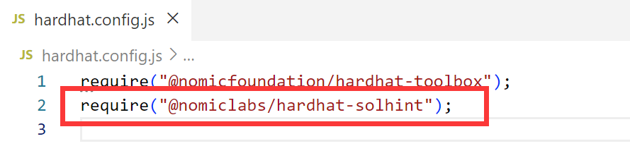
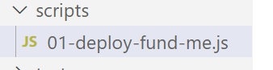

# hardhat-fund-me-fcc study report

## 1.新建目录

首先新建一个项目folder，mkdir hardhat-fund-me-fcc

然后code .呼出vscode，因为我这个是win系统，在vs里reopen the folder in wsl


## 2.初始化hardhat环境

`yarn add --dev hardhat`配置依赖，然后我们就有了package.jason以及nodes_module


然后初始化hardhat项目`yarn hardhat`

会给你一些初始化提示，是否帮你创建一些小配置文件


最后一个是帮我们install一些高级的项目必备的配置，有一些我们用不到，但是可以全安装了


### solhint插件安装：

`yarn add --dev @nomiclabs/hardhat-solhint `

then,hardhat.config.js add `require("@nomiclabs/hardhat-solhint");`




创建这两个配置文件操作此插件


使用测试`yarn solhint contracts/*.sol`


可以得到代码第十行有个变量的可见性状态没有指明


### prettier插件安装：

`yarn add --dev prettier prettier-plugin-solidity`

同样创建配置文件操作此插件


### dot env插件安装：

`yarn add --dev dotenv`

导入dot env配置文件


## 3.把合约粘贴进来


合约内部引用了外部接口

`yarn add --dev @chainlink/contracts`


### 编译

此时编译器还爆红，但是我们已经导入了所需接口依赖

直接去编译`yarn hardhat compile`


### 部署

后续我们需要频繁的部署合约，早期我们是自己写deploy.js部署合约，现在我们需要借助插件便捷完成合约部署，使用 hardhat-deploy插件

`yarn add --dev hardhat-deploy`

下载好依赖后去hardhat.config.js里添加依赖声明require

`require("hardhat-deploy")`


`yarn add --dev hardhat-gas-reporter`

`require("hardhat-gas-reporter")`


`require("solidity-coverage")`


## 4.写部署脚本



这个脚本就是我们调用hardhat deploy调用的脚本函数来进行部署合约


配置文件导出并在别打文件声明导入


在别打js里使用


## 5.在使用hardhat deploy时自动上传etherscan进行verify

首先 你verify只能是上传goril测试网，或主网，如果在hardhat本地网络是没法验证的。


所以我们在部署脚本下面加一个判断，

```
  if (
        !developmentChains.includes(network.name) &&
        process.env.ETHERSCAN_API_KEY
    ) {
        await verify(fundMe.address, [ethUsdPriceFeedAddress])
    }
```


## 在Solidity中，memory的作用是什么(尤其是在字符串方面)?

因为string在技术上是一个动态大小的数组,因为string是一个数组,所以我们需要添加memory给数组指定数据位置,但是我们无法在_name前面添加storage关键字,Solidity也知道,这是一个函数,这个 _name变量实际上并没有存储在任何地方,故这个 _name变量只接受memory和calldata。

总结:当我们将数组,结构和映射作为参数添加到不同的函数时,需要给出memory或calldata关键字。


```
git commit -m "first commit"
git branch -M main
git remote add origin https://github.com/iceee404/FundMe-Front-Html-Js.git
git push -u origin main
```