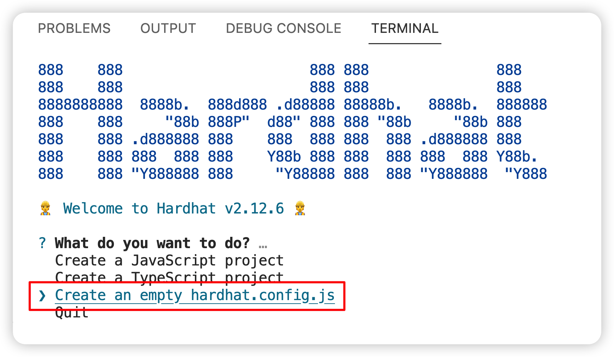
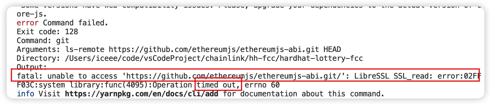

# Lottery smart contract record


首先确保你的node，npm，yarn版本合适，不合适的卸载nvm重装管理。


## 初始化hardhat环境

`yarn add --dev hardhat`

> 确保你的node版本合适，否则会提示node版本不匹配


## 创建新的hardhat项目

`yarn hardhat`

选择空项目即可



## 配置依赖和插件

这时候你的hardhat.config.js是一个空的文件，里面只有你的solidity配置，没有任何其他包，所以我们是从0开始配置。

后面我们会在package.json里添加我们的各种依赖。

`yarn add --dev @nomiclabs/hardhat-ethers@npm:hardhat-deploy-ethers ethers @nomiclabs/hardhat-etherscan @nomiclabs/hardhat-waffle chai ethereum-waffle hardhat hardhat-contract-sizer hardhat-deploy hardhat-gas-reporter prettier prettier-plugin-solidity solhint solidity-coverage dotenv`


> 
>
> 安装依赖遇到问题，根据提示，得知是访问github的网络问题，设置访问git的流量走我们clashX的端口即可
>
> `git config --global --add remote.origin.proxy "127.0.0.1:7890"`
>
> 7890替换为你的代理工具端口号


刚才以及安装了prettier插件的依赖，接下来创建一个配置文件配置一下我们的格式化代码规则，方便在我们保存代码的时候可以自动规则的格式化。

在目录下新建 `.prettierrc`

```
{
    "tabWidth":4,
    "singleQuote":false,
    "printWidth":100,
    "semi":true
}
```

按照自己的习惯配置即可。

`yarn add --dev prettier prettier-plugin-solidity`


接下来在hardhat.config.js导入依赖（js版本和ts版本导入的语法不同）

```
require("@nomiclabs/hardhat-waffle")
require("@nomiclabs/hardhat-etherscan")
require("hardhat-deploy")
require("solidity-coverage")
require("hardhat-gas-reporter")
require("hardhat-contract-sizer")
require("dotenv").config()

/** @type import('hardhat/config').HardhatUserConfig */
module.exports = {
  solidity: "0.8.17",
};
```


## 开始写智能合约

首先新建一个文件目录contracts来保存我们的智能合约文件


`yarn add --dev @chainlink/contracts`