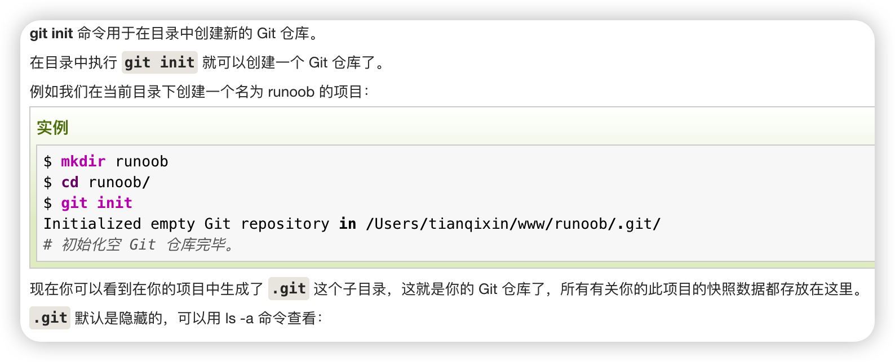

# Git and GitHub record

分布式版本控制工具 和 代码托管平台

> ## Quick Start
>
> 1.在文件夹下git init
> 2.git add . 
> 把工作区的文件添加到暂存区
>
> 3.git commit -m "xxx"
> 把暂存区提交到本地库。
>
> 4.git push {alias} {branchName}
> 把本地库提交到对应的远程仓库
>
>
> 如何设置远程仓库呢？
> git remote add {alias} {https or ssh}
>
> git remote -v查看是否设置成功

`git init`

 

`git add  ./hello.txt`

添加文件到暂存区

`git commit -m "xxxx"`

添加暂存区文件到本地仓库main分支，当前版本生成

`git status`

查看版本信息，各种信息

`git reset --hard {versionId}`

切换版本

- 在本地库移动指针
- 重置暂存区
- 重置工作区

`git branch`

查看分支列表，以及当前分支

`git branch {branchName}`

创建分支

`git branch -d (branchname)`

删除分支	

`git checkout {branchName}`

移动分支

`git merge {branchName}`

将branchName分支合并到现在所处的分支，如果当前分支也有新内容会无法自动合并，会把conflict标注进去文件，你需要自己vim进去进行选择性合并解决conflict

`git remote add {alias别名} {https or ssh url}`

设置远程仓库的地址

`git remote -v`

查看你设置的远程仓库的别名地址

git status 确定没有更新后就可以去push

`git push {alias别名} {branchName}`

push都是以分支为单位的，所以最后是分支名
