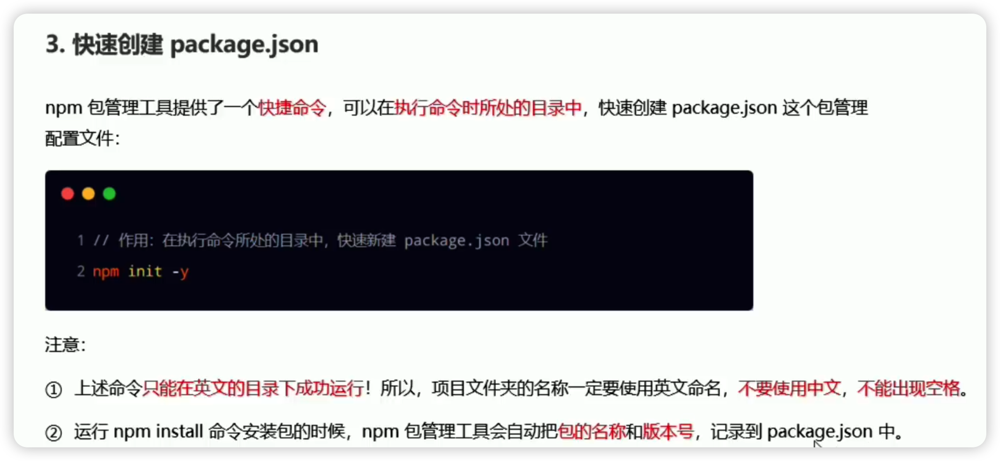
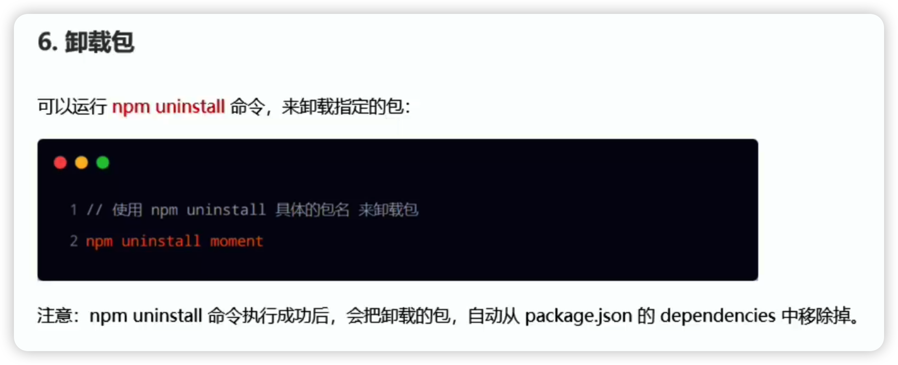

# node.js记录

首先node.js是一个javascript的运行环境。

和运行在前端的js区别是，浏览器的js运行环境多了dom bom等模块，所以在后端nodejs环境中是无法使用那些模块的方法的。

但是nodejs官方也提供了很多有用的模块供你使用。

fs文件系统模块

1.导入fs模块

`const fs  = require("fs");`

2.path路径拼接处理模块

挂载对象和挂载属性不同：

npm下载镜像源管理工具nrm：

下载的包分为两类，一类是项目包，一类是全局包。

上面nrm就是全局包-g安装。

如何查看包目录：

介绍一个包：

