# 基础课笔记

# 一、介绍课程

# 二、btc-密码学知识

1. 哈希、

cryptographic hash function 的两个重要性质：

- collision resistance哈希碰撞

  不同的输入，哈希值一样，当哈希值范围（输出空间）有限大，鸽笼原理，输入无限大，必然会哈希碰撞。

  但是需要注意的是，你没有好的办法找到两个不同的输入，他们的哈希值相等，除非你蛮力求解，但是这个很难做到，工作量太大了。

  所以利用此性质，你可以对文件进行  是否被篡改的检测。

  > 此性质没法数学证明，都是实践出来的，会有哈希碰撞
  >
  > md5已经被破解可以认为找到相同哈希值

- hiding

  不可逆，你知道哈希值但是没法找到输入的数据

  前提是你的输入范围一定要大，而且要离散，如果比较小而且集中在某几个值，那么此性质不好用

- 前两个性质结合就是：digital commitment / digital equivalent of a sealed envelope

  > 预测无法提前公开，你就需要一个sealed envelope
  >
  > 预测股票例子：大佬预测某个股票第二天会涨停，但是如果提前公布，大佬的地位发出预测会对股票产生影响，但是不公布等第二天涨停了公布又无法证明你预测成功，所以需要一个sealed envelope，把预测的股票名字写在纸上存在密封信封里，第二天打开即可，密封信封即代表不可篡改。
  >
  > 电子世界里，你就可以用上面两个性质得到digital commitment 性质，即 提前公开 你预测的股票的名字的哈希值，然后由于有hiding以及collision resistance，你在第二天公布你说的股票名字后，只需再次计算哈希值就知道你是否修改了最初的预测。
  >
  > 需要注意的是，现实世界里由于股票的个数有限且并不多，所以一般会在股票名字后面加一个nonce再做哈希计算，保证输入的范围足够大。


前面是密码学里哈希函数要求的两个性质，比特币中还有一个性质要求：

- puzzle friendly

  没有什么好的办法可以知道结果的大致样子，比如你想要000开头的哈希值，你是不知道输入什么可以得到这个大致样子的哈希值的。

在比特币挖矿中，你需要做的计算就是H（block header+nonce）,你需要做的就是找到一个nonce使这个区块头加上你这个nonce算出的哈希值<=target。


所以puzzle friendly的性质就保证了，挖矿这个行为是没有捷径可以走，只能不听的试，所以你挖矿才可以作为POW，proof of work。


需要注意的是，挖矿虽然很难，但是当有人算出来时，他把这个nonce发布出去后，别人验证的时候确很简单，只需计算一次哈希函数H（block header+nonce）。


比特币使用的是SHA-256，Secure Hash Algorithm

2. 签名

（public key, private key）

签名用的是私钥，验证用的是公钥


# 三、btc-数据结构

hash pointer哈希指针：除了保存区块地址，还有此区块哈希值

区块链和普通链表的区别？

block chain is  a linked list with hash pointer.


区块链中的第一个区块：genesis block创世区块

最新的一个区块：most recent block


新的区块的哈希值由上一个区块的内容和值计算得来，所以你无法篡改前面区块的内容，修改后就是后面的都对不上，就会被弃用


merkle tree

binary tree


只要你的数据结构是无环的，你都可以使用哈希指针构造。（保证安全性不被篡改）

如果有环了，那就是类似循环依赖的意思。


四、btc-协议

double spending attack双花攻击

解决办法：由央行维护一个大表，记录此编号币在谁手里。

此时当你再进行交易时，除了使用公钥验证币上央行的私钥签名，还需要验证此币确实还在你手里，否则你可以复制这个币，也就是个文件，再次去交易，而央行的私钥签名复制后别人拿公钥验证肯定是没问题的，但是其实你这个币已经花出去了，就是所有者不是你了，所以由央行维护一个大表可以解决双花攻击，一个币花两次。


# 1 BTC

## **1.1 BTC-密码学原理**

> 加密货币不加密
>
> 只用到两个概念
>
> - 哈希
>
> - 签名

### **1.1.1** **cryptographic** **hash function**

- **collision resistance 哈希不碰撞**
  - 哈希碰撞：输入不同，输出相同
  - **不存在改变输入但是输出仍然不变的情况**
  - MD5
    - 曾经可以，但是现在被王小云院士破解了

- **hiding 单向不可逆**
  - 只可用蛮力破解

上述两种性质可以实现**digital commitment**或者**digital equivalent of a sealed envelope** (sealed envelop：**预测可能会对结果产生影响**，因此可以将**H(x)**作为**预测值公布**，之后验证x，实际操作的时候用的是H(x||nonce)来保证均匀分布)

BTC使用的hash (SHA-256, Secure Hash Algorithm) 还有一个性质：

- **puzzle friendly (difficult to solve, but easy to verify)**
  - 已知一个哈希值范围，我们很难去找到一个值使其生成的哈希值在这个范围内

- 挖矿就是一直试不同的nonce（随机数）使得$$$$H(block~header)\le target $$$$即为合法值，必须通过遍历来试——工作量证明proof of work

### **1.1.2 账户管理**

开户的过程：创建一个公钥和私钥 `(public key, private key)`

- 来源非对称加密体系

- 加密和解密用的都是接收方的
  - 传输信息：加密用对方的公钥，解密是对方用对方自己的私钥

公钥：账号；私钥：密码

BTC交易时用**私钥**来做**签名**，其他人用**公钥**解密验证

假设产生公私钥的过程使用的是**好的随机元** a good source of randomness

- 两个人的公私钥对相同的概率很低

## **1.2 BTC-数据结构**

### **1.2.1 Hash pointers**

保存**结构体首地址**和其**hash**值

- 找到位置并且检查是否被篡改

如果有环的话，就产生问题

- **循环依赖**

### **1.2.2 Blockchain**

Block chain is a linked list using hash pointers.


区块链是和普通链表的区别在于

- 用哈希指针代替原先的指针

- 第一个区块叫**genesis block**，最后一个区块是most recent block，由hash pointer连接起来，注意hash值是对前一个区块整体取hash得到的——tamper-evident log
  - 如果其中一个区块修改了，则之后的区块都会被修改，因为H()被修改了，所以我们只需要检测最后一个块就可以知道是否被修改了
  - 所以我们有时候只需要保存最近的几个区块，当用到前面的区块时，我们再去向其他节点要这个区块

### **1.2.3 Merkle Tree**


和Binary Tree的区别是用**hash pointer**代替binary tree的指针

内部节点都是**hash pointer**，leaf是**data block**（交易数据**transaction**），对根节点取hash就是**root hash**

- 只需要记住root hash就可以记住对整棵树的修改，同理

BTC有两种节点：全节点（保存**block header**和**block body**）和轻节点（只保存block header）

- Block header保存root hash，通过链式结构，保证了**交易的不可篡改性。（轻量级的设计）**

- Block body保存全部值，交易数据

在Bitcoin等区块链平台，使用Merkle tree来对区块中的交易进行**汇总和验证**，并将Merkle root作为对所有交易的汇总嵌入到block header中

[merkle tree在区块链的应用](https://blog.csdn.net/mutourend/article/details/114384264)

在 [Bitcoin白皮书](https://bitcoin.org/bitcoin.pdf)中提及了将Merkle tree用于：

- 保证交易的不可篡改性

- blockchain pruning
  - 将本地不需要的交易数据移除

- simplified payment verification (SPV)
  - 交易验证，如下

Q：怎么证明轻节点 交易已经完成？

A：Merkle Tree提供了Merkle proof


假设黄色tx想知道他是否被包含在这个区块上，现在轻节点只有一个block header，他向一个全节点请求，全节点给他发送三个红色的哈希值，轻节点可以在本地依次**从下到上**计算出三个绿色的H()，先算出第一个，再让其和红色拼接出来再计算下一个绿色哈希值，依次向上。最后把计算出的根哈希值和block chain里的根哈希值比较即可。

> 只需要验证从下到上的路径上的哈希值都一样即可
>
> - 路径上不变，根就不变
>
> 强行制造哈希碰撞不可行：绿色的H()修改了，不可以通过修改红色的H()导致生成的H()不变

**proof of membership** (inclusion) 复杂度 $$$$\Theta(\log n) $$$$假设有n个交易数据

**proof of non-membership** (non-membership)：将leaf按照hash值排序，然后对需要被验证的transaction取hash看位于哪两个leaf之间，只要能证明这两个leaf能够推到root正确，就说明这两个leaf是相邻的，从而看是不是在其中。

验证复杂度 $$$$\Theta(\log n) $$$$，需要排序的称为Sorted Merkle Tree但是BTC不需要验证non-membership

## **1.3 BTC-协议**

数字货币存在**double spending attack**

- 用一个大表 记录现在某张的归属权在哪？

如何去中心化的去发行货币？

- 谁来发行货币，什么时候发行，发行多少

- 怎么防范double spending？

区块链：每个交易要包含输入和输出

- 输入包含钱的来源——**铸币交易**coinbase transaction（使用hash指针）以及**转账人的公钥**
  - 防止双花
  - 为什么要有转账人的公钥？为了对交易签名验证

- 输出包含收款人公钥的hash，还需要转账人的签名
  - 需要转账人的签名，需要大家都知道，去验证是不是完成了这笔交易
  - 是不是本人亲自转账，而不是非法偷走了

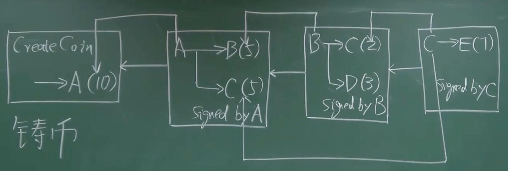

每个节点都需要知道转账人的公钥，因为**交易签名使用的是转账人的私钥**，大家验证需要使用其**公钥验证**

铸币交易的输出包含获得人的公钥，后续交易的输入公钥需要和最初的coinbase交易的公钥对得上

实际上BTC上每个区块链上都也很多交易组成Merkle Tree

每个区块分成Block header和Block body

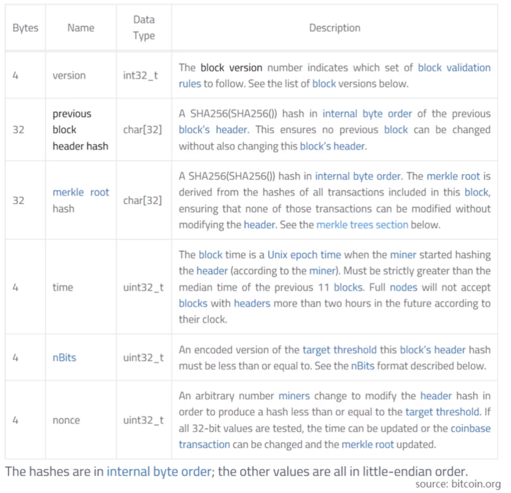


| Block header                                                | Block body       |
| ----------------------------------------------------------- | ---------------- |
| version                                                     | transaction list |
| hash of previous block header  (only caculate block header) |                  |
| Merkle root hash                                            |                  |
| nBits（256位target的压缩编码 4bytes，目标阈值）             |                  |
| nonce                                                       |                  |

> $$$$H(block~header)\le target $$$$
>
> 只对block header哈希
>
> Merkle root hash保证了block body不被篡改

BTC每个节点可分为full node (fully validating node) 和 light node (只保存block header)，主要是后者，轻节点没有办法独立验证，没有参与区块链的维护，只是**查询**

- 为什么这么设计？
  - 功能拆分
  - 节省空间

账本内容要取得**分布式的共识**distributed consensus，共同维护**distributed hash table**

有人提出FLP impossibility result，即在一个**异步**且**时延没有上限**的网络中，只要有一个人是faulty，整个网络就无法达成共识；另外有人提出**CAP Theorem (Consistency, Availability, Partition tolerance)**，即这三个性质最多得到两个

BTC的共识协议：

若采用投票，需要确定**membership**（如hyperledger fabric联盟链，只有某些大公司能参与，投票可以），BTC中恶意者不断产生公私钥直到超过一半就一直获得投票权——sybil attack。

算力投票

在BTC中，$$$$H(block~header)\le target $$$$中有一个4bytes的nonce随机数，求出符合该式的nonce即可获得**记账权——共识**，其他人检查是否符合要求

当hash of previous block header不是指向longest valid chain的最后的时候，这个区块就新开了一个分支（分叉攻击forking attack），正常情况应该是接在最长合法链的后面。

但是还有一种情况，**两个区块同时获得记账权**，都接在longest valid chain的最后产生分叉，此时各个本地区块会根据网络延迟先接上两者之一。之后如果在两者其中之一继续先扩展下一个区块（看算力和运气）就变成了最长合法链，另外一个就变成了orphan block**被丢弃掉**

**Coinbase transaction 是唯一的一个造币的过程**

BTC设置**block reward**来让大家争夺记账权，因为这是铸币的唯一方式

Block reward会不断减半，比特币初试设置出块时间大约为10min，当后续算力增加导致出块时间更快，比特币还设置了每隔2016个区块改变挖矿难度，使出块时间维持在10min左右，每隔21w个块后区块奖励减半（25-12.5-6.25-3.125）

> 防止女巫攻击，你增加了用户数量，但是你的**算力**还是**不变**的
>
> 争夺记账权的过程就是挖矿，就是依靠计算机算力不断的试出来那个nonce，是的此区块头加上这个nonce的哈希值小区区块头上的target，这个过程注定是可以证明你工作量的。

## **1.4 BTC-系统实现**

BTC：transaction-base ledger 基于交易的账本模式

全节点在内存中维护**UTXO** (Unspent Transaction Output)，**以便快速检查double spending**

- 还没有被花掉的交易的输出
  - 一个交易可能有多个输出（A给B转了5个btc，给C转了3个btc）
  - Total inputs = total outputs，有些交易的total inputs可能会大于total outputs，多余的部分作为transaction fee给矿工

- UTXO的每一个元素需要给出产生这个输出的哈希值，以及他是第几个输出

> 如果你收到btc永远不花，那你的收到钱的这个输出信息，永远保存在utxo

除了出块奖励之外，为了防止某人在打包区块链的时候只打包自己的交易记录，于是提供了**transaction fee**作为奖励


> ETH：account-based ledger
>
> 系统**显式地记录每个账户上的币**，不需要说明币的来源。对于比特币的transaction-base ledger 基于交易的账本模式来说，没有一个地方显式记录了你这个账户存在多少个币，需要去根据哈希指针溯源查找验证币的来源一直到铸币交易。


为了**增大nonce的搜索空间**，可以使用**coinbase** txn的前几个字节作为extra nonce，**因为coinbase txn的内容是随意的但是修改它会导致Merkle Tree Root的hash值发生改变**

每次求解nonce可以看做是bernoulli trial伯努利过程（只有两个结果的随机过程），成功概率很小，接近于**Possion分布**。

伯努利过程一个性质是**无记忆性memoryless**（将来挖的时间和过去挖的时间没有关系），出块时间服从**指数分布**，系统**平均出块时间**为10min，将来要挖多少时间和过去做了多少时间无关，progress free


progress free保证了所有矿工是公平的，仅按照算力平均分配奖励

- 挖矿公平性的保证

BTC的数量：

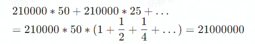

> 比特币的稀缺性是人为制造的
>
> 比特币的挖矿对比特币的安全性是至关重要的
>
> 比特币的挖矿过程就是找符合条件的nonce，过程本身无意义，但是挖矿的记账以及打包出块又维护了比特币的系统，所以说Bitcoin is secured by mining

挖矿求解过程没有意义，但是Bitcoin is secured by mining：当**大部分算力**掌握在**诚实节点**上的时候就是安全的（用算力投票）

记账权的获得有时候看运气，所以可能会落入恶意节点，此时

- 不能偷币（因为没有转账人的私钥签名，即使写到链上，它不是最长**合法**链所以诚实节点不会接上去，诚实的节点不会承认坏账，所以此恶意攻击者甚至拿不到出块奖励）

- 可能出现double spending——难度较大（forking attack，同时写入转账和回滚产生**分支**，交易平台看到写入转账的区块就认为交易成功，但是之后可能回滚分支成为最长合法链，如果本来转账分支之后就已经接着很多区块了，这种方法就比较**困难**，因为**很难再次获得记账权**。所以BTC的防范方法是**six confirmation**，需要1小时时间（一个区块10min刚好6个），故BTC的不可篡改性是**概率上的保证**；另一种方法是zero confirmation，直接选择最先被接受的节点，或者电商平台本来交易完到发货就有时间差可以用来检验合法性）
  - 电商天然有一定的处理时间

- 故意不包含合法交易，但是总有合法的区块会发布这些交易；其实正常的时候也可能不包含某些合法的区块，但是会等到下次再发布

- selfish mining——正常情况下挖到区块直接发布，但是也可以挖到多块区块连在一起然后**forking attack**一次性接上去。但是前提是恶意算力比较大的时候才比较容易成功篡改。但是这种方法也有好处，**让别人做无用的功**，减少竞争，关键还是需要算力比较大，**风险在于当别人比你早挖出来的时候要赶紧接上去，因为如果别人挖出来了，我就白挖了，需要重新计算哈希**

  - 仍然比较困难，需要51%的算力

  > selfish mining ： 你自己很强的时候你可以这样搞，然后盖掉别人挖到的块，相对于别人挖出的x个块，你这边直接甩出去y个块，y>x，可以直接覆盖那x个，导致那x个块变成orphan block，此链弃掉，
  >
  > 优点是，就是你在挖后面的那些块的时候没人跟你竞争，你拿着自己还没发布的块的哈希往下继续算nonce，此时因为前面块没有发布，所以你计算nonce的时候没有人跟你竞争，因为只有你知道前面的块的区块头。
  >
  > 缺点是，如果你不是算力很强，无法超过另一条链，你就会一无所有，前面先算出来的块也没有block reward了


## **1.5 BTC-网络**

BTC工作在application layer，底层network layer是P2P Overlay Network，在这个网络里所有节点都是平等的，没有super node/master node，加入网络需要知道seed node种子节点

BTC网络的设计原则：**简单，鲁棒而不是高效**

消息传播采取flooding的方式，消息转发给邻居节点，并且表示消息已发送；下次就不会再发了

邻居节点的选取不考虑底层的拓扑结构，可以世界各地，为了增强了鲁棒性，但是牺牲效率


比特币系统维护了一个等待上链的集合，并发给邻居节点。

risk：同时广播了冲突的两个交易


无论广播A——>B 还是 A——>C，都要在集合里删除A——>B

越是大的区块传播速度越慢

BTC协议对区块大小的限制为1M

BTC传播方式很耗带宽，1M需要10几秒

best effort，**一个交易不一定让所有节点都收到，顺序也不一定一样**，有些节点可能转发错误的交易

## **1.6 BTC-挖矿难度的调整**

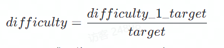

分子是当难度为1（最低）的时候的目标阈值，是一个很大的数；挖矿难度和目标阈值成反比

矿机变多，挖矿难度不变，会导致出块时间越来越短

**出块时间不是越短越好**：这个区块在网络上来不及广播，使得**多分叉**变成常态，一旦出现多分叉，善意的算力被分散，而恶意算力可以集中在一个分叉上使得其不断延伸成为最长合法链，使得51% attack的数字会变小


怎么调整挖矿难度？

target是目标阈值，越大难度越低。

每2016个区块调整一下难度，大概是14天一次，代码里会自动让所有节点都调

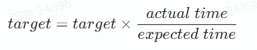

actual time：最近的2016个区块的出块时间

expect time：2016个区块x10min =14天


当比值大于1，说明实际出块时间币预期时间慢，所以target变大，这样算力找随机数使哈希值小于等于target时就更容易了，接下来出块时间自然会减少。

需要注意的是，这个比值可能再极端情况下有极大的偏差，所以设置了这个比值是在`1/4 ~ 4`之间。防止一次难度变化特别大。


如何让所有矿工去调整呢？

btc开源代码，挖矿程序必然会调。

但是如果你改了自己本地代码不调整怎么办？

恶意节点无法执行调整nBits来降低难度因为别的**区块验证会通不过**。


上面的参数不清楚是否是中本聪经过什么调研的，但是整体都是make sense的

## **1.7 BTC-挖矿**

全节点：

- 一直在线

- 在本地硬盘中维护完整的区块链信息

- 在内存中维护UTXO集合，以便快速检验交易的正确性

- 监听比特币网络上的交易信息，验证每个交易的合法性

- 决定哪些交易会被打包到区块里

- 监听别的矿工挖出来的区块，验证其合法性
  - 交易合法（包括铸币的金额）
  - 是否符合难度要求，即block header取hash前面是否有足够多的0
  - 检查难度目标阈值是否正确
  - 是否接在最长合法链上

- 挖矿
  - 决定沿着哪条路挖下去？最长，出现分叉，选择最先听到的一个

轻节点：

- 不是一直在线

- 不用保存整个区块链，只要保存每个区块的块头

- 不用保存全部交易，只保存与自己相关的交易

- 无法检验大多数交易的合法性，只能检验与自己相关的那些交易的合法性

- 无法检测网上发布的区块的正确性

- 可以验证挖矿的难度
  - headr里有nbits，和target有关，target和difficulty有关

- 只能检测哪个是最长链，不知道哪个是最长合法链

当监听到有人挖出一个区块之后，自己需要停止当前的挖矿然后重新打包一个区块然后开始挖矿——并不可惜，因为无记忆性 memoryless/progress free

区块链的安全性是怎么保证的？

- 密码学的安全，他人不知道你的签名

- 基于大部分的矿工都是诚实的

CPU——>GPU——>ASIC

> 很多部件是闲置的——>专用

目前挖矿常用ASIC（Application Specific Integrated Circuit）芯片，除了挖矿啥都干不了，只适用于一种**mining puzzle**。有些币的mining puzzle会设置成和一个比较火的币一样，这种情况成为merge mining。

> Alternative mining puzzle是为了ASIC resistance，让普通电脑也能挖矿

自己挖不太划算

矿池：pool manager矿主连着很多miner矿工，前者管理区块打包等工作，后者只负责解puzzle，如果挖出来就大家分成。分配收益的方法：每个矿工挖到一个share（almost valid block即接近valid block的一个区块，降低难度后的block）就发给矿主作为**工作量证明**，然后根据share来分配挖到的reward。矿工不能自己发布出去赚钱，因为这个任务是由矿主分配的，这个区块的收款人地址是矿主，如果他改了这个地址那么就相当于单干，因为Merkle Tree Root值发生改变，矿主不会认为他是share

有没有可能矿工挖到了之后不提交块，有可能的，参与分红，但是搞破坏（可能会有内鬼），转换矿池很容易。

矿池也让51%算力这件事情变得有可能了

如果某个矿池得到51%算力，就可以使用分叉攻击、Boycott（**封锁交易**，所有和某人有关的交易全部回滚，不需要等待6个confirmation，这样别的矿工也会不打包和该人有关的交易，逼迫站队），但不能把别人的钱转走（因为没有**别人的私钥**）

## **1.8 BTC-脚本** 

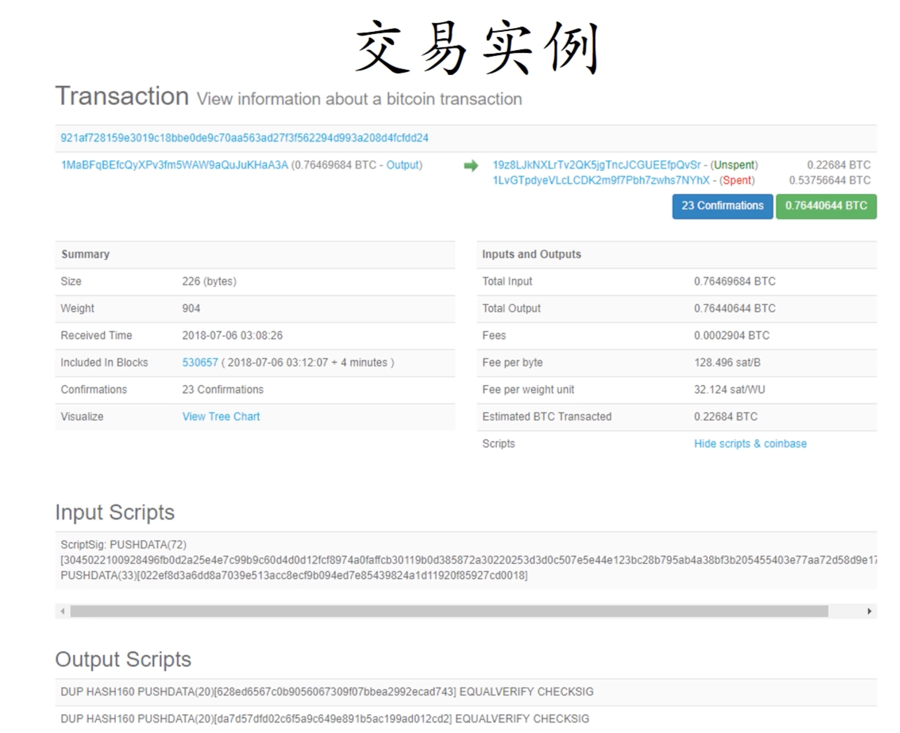

基于栈的语言

```JSON
"result": {
     "txid":"921a...dd24",
     "hash":"921a...dd24",
     "version":1,
     "size":226,
     "locktime":0,
     "vin":[],
   "vout":[],
   "blockhash":"00000000002c510d...5c0b",
   "confirmations":23,
   "time":1530846727,
   "blocktime":1530846727
 }
 // locktime为0表示立刻生效，生效时间
 
 "vin": [{
     "txid":"",
     "vout":0,
     "scriptSig": {
         "asm":"",
         "hex":""
     }
 }]
 // 输入可以有多个，txid是之前交易的编号，交易资金来源
 // 上面vout的值表示是txid交易的第几个输出
 // 输入脚本 scriptSig
 // 输入可能需要多个签名
 "vout": [{
     "value":0.1,
     "n":0,
     "scriptPubKey": {
         "asm":"DUP HASH160 628e... EQUALVERIFY CHECKSIG",
         "hex":"76a9...",
         "reqSigs":1,
         "type":"pubkeyhash",
         "addresses":["...."]
     }
 }]
 // value是金融，单位是比特币
 // n 是序号
 // scriptPubKey是输出脚本
 // 上面n表示为当前输出的第几个，asm输出脚本的内容，reqSigs表示需要的签名数量
```

 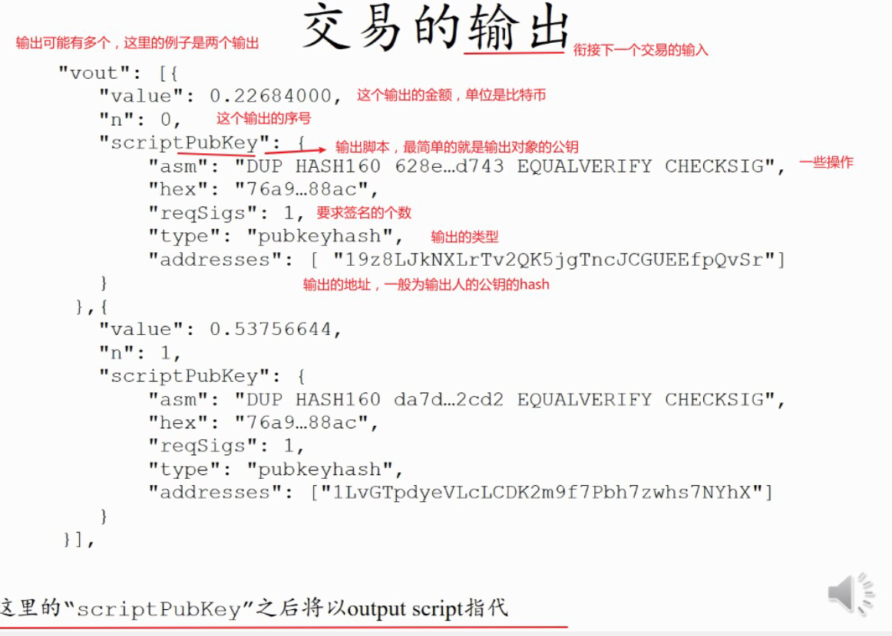

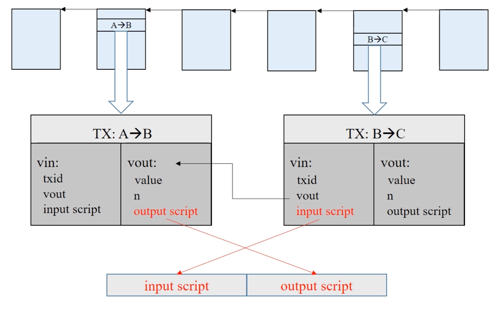

某个区块A的输入来源于区块B的输出，那么将A的input script和B的output script（注意**不是**A的output script）拼接在一起，先执行前者，后执行后者，如果结果为**true**就表示合法

> 前面都有op
>
> op_dup等

几种类型：

- P2PK (Pay to Public Key)
  - input script
    - PUSHDATA (Sig)
  - output script
    - PUSHDATA (PubKey)
    - CHECKSIG 检查签名

- P2PKH (Pay to Public Key Hash) 最常用
  - input script
    - PUSHDATA (Sig) 压栈
    - PUSHDATA (PubKey) 压栈
  - output script
    - DUP 复制一份栈顶并压栈
    - HASH160 弹出栈顶pubkey取hash压入栈
    - PUSHDATA (PubKeyHash) 压入pubkeyhash
    - EQUALVERIFY 弹出栈顶两个hash值是否相等，防止某人以自己的公钥顶替
    - CHECKSIG 最后将sig和pubkey进行check正确就返回true
  - 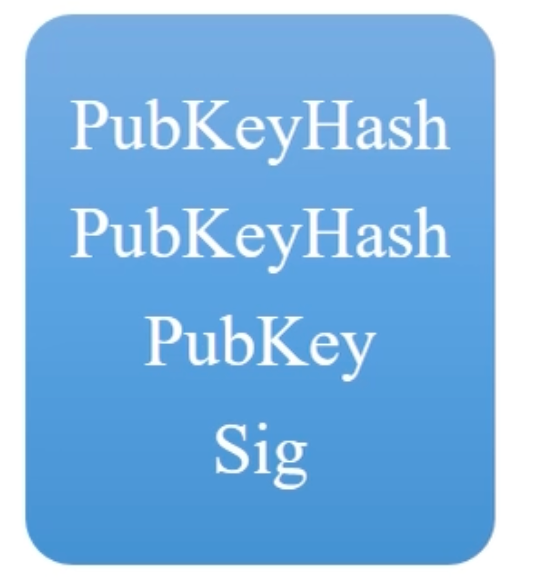

- P2SH (Pay to Script Hash)
  - input script
    - ...
    - PUSHDATA (Sig)
    - ...
    - PUSHDATA (serialized redeemScript)
  - output script
    - HASH160
    - PUSHDATA (redeemScriptHash)
    - EQUAL
  - 简单来说就是内嵌有一个redeem script，首先执行input和output，最后执行redeem的内容；简化output script，便于用户
    - 验证是不是真的redeem script
    - 反序列化script，执行script
  - **应用场景：支持多重签名**
  - 将input script中改成
    - false (Bitcoin的实现BUG，**这里多压入一个没用的元素**)
    - PUSHDATA (Sig_1)
    - ...
    - PUSHDATA (Sig_M)
    - PUSHDATA (serialized redeemScript)
  - 将redeemScript写成
    - M 表示总的签名数
    - PUSHDATA (pubkey_1)
    - ...
    - PUSHDATA (pubkey_N)
    - N 表示总的public key数
    - CHECKMULTISIG
  - 


- Proof of Burn
  - output script
    - RETURN [zero or more ops or text]
    - 这种形式的output被称为Provably Unspendable/Prunable Outputs
  - 脚本说明：return直接返回false，这个output无法被花出去，UTXO可以剪枝
  - 应用
    - AltCoin (Alternative Coin) **销毁**Bitcoin获得小币
    - **花费非常少**的BTC将某些内容**取hash放到return后面**，这样就能放到区块链上 （coinbase中也是随意记东西的，但是只有获得记账权的节点才能写东西）（专利取hash放上去，如果产生纠纷就可以证明）
      - 发布交易不需要记账权

## **1.9 BTC-分叉**

- state fork 状态分叉，意见分歧
  - 包括forking attack，也被称为deliberate fork

- protocol fork 协议分叉

- 比特币的协议发生改变，改变比特币的协议需要升级软件，但不是所有节点都会升级软件
  - 出现协议意见上的分歧

- 不同协议造成的分叉

- 根据对协议修改内容的不同
  - 进一步分成hard fork和soft fork

- hard fork
  - > 有新特性，但是有人不承认新的特性

  - 旧节点不承认新节点
  - 扩展新的特性（如修改block size为4M）时如果不认可新的特性就会产生硬分叉
  - 旧节点在原来的链上不断延伸，新节点在新的链上延伸，产生**永久性**的分叉；必须所有节点都更新，才不会有永久性的分叉
  - 当前交易速度约为每秒7笔交易
  - 由此社区分裂成**两帮人**，一个币拆成了两个币，各自有自己的chain id 
    - ETH的前身是ETC，ETC现在也还有，曾经硬分叉
    - 分叉完需要进行一些操作，各自有自己的chain id，以防两条链进行交叉交易

- soft fork
  - 新节点不认旧节点
  - **临时的分叉**（如修改block size为0.5M）
  - 旧节点同时承认两条链，此时新节点又不会认当前链为最长合法链而新开一个分叉，所以旧节点挖老大链就白挖了，只有挖和新节点一条链才合算。
  - 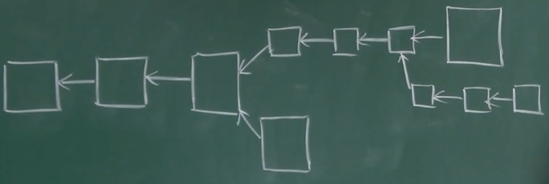

  - 最终还是会变成一条链，只要出现半数以上的节点更新软件，只有临时的
  - 例子：给原来的某些域一些新的含义，比如给coinbase域（铸币）增加含义extra nonce+UTXO的根hash
    - 一部分coinbase域的extra nonce
    - 另一部分是把UTXO写成merkle tree，算出根hash，记在coinbase里
    - 是软分叉，因为如果旧节点不按这样格式写，就不会被承认
  - P2SH
    - 新节点不承认旧节点
    - 旧节点只验证第一步，新节点还需要验证第二步

## **1.10 BTC-课堂问答**

- 如果收款人没有连接到BTC网络？
  - 没有关系，转账只需要在区块链记录

- 账户私钥丢失了怎么办？
  - 账户上的钱就变成了死钱；泄露了，就赶紧转移到其他安全的账户里，因为没有办法冻结

- 转账的时候写错了地址？
  - 没有办法取消已经发生的交易，可以商量

- 交易所容易被攻击，会丢失数字货币；硬件钱包比较安全

- 我们可以转账到一个死账户，但是取不出来，并且会给全节点造成很大的负担

- OP_RETURN永远返回false为啥会写到区块链上？
  - 验证过程是把自己的input 和 输入的output拼在一起，然后验证，只要有错误就寄了
  - 因为这个RETURN语句是写在当前脚本的output script，因此在验证**这笔**交易的时候并不执行当前脚本的output，是在其他交易需要output的时候进行验证，所以只需要别人没有用这个output去验证就可以

- 你可以偷别人矿工的答案吗？
  - Coinbase tx里面有写好了把交易费给哪个矿工，如果你想偷，就需要修改，修改的话，就会导致整个merkle tree 修改，根hash修改

- 交易费给哪位？
  - 交易费等于总输入减总输出，剩下的直接给挖到的矿工即可

## **1.11 BTC-匿名性**

pseudonymity 笔名/网名

- 一个人可以多个账号

匿名性不如纸币高于银行（除 实名制），比特币是完全公开的，大家都可以看到账单

其实匿名信不高

- 公开的

- 不可篡改性

**破坏匿名性的方法**

1. 不同账户之间可以建立关联也可以**形成关联**

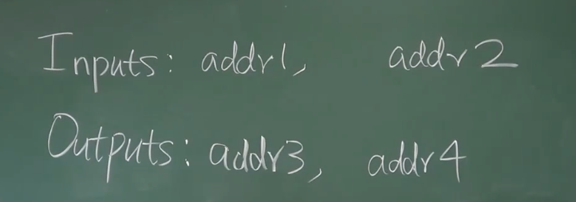

输出一般会有一个**找零钱的地址**

如果想隐私保护，可以做一些没用的转账信息

但是还是可以被发现的

1. 比特币账户和现实生活的真实身份也可以关联

和实体世界发生联系，就可以发生联系

- 资金的转入转出（一开始买入区块链就会有资金流入，会泄露身份，比特币会转出成现金）

- 实体商家用比特币支付，得到商品

谁是匿名性最好的人？

不交易的人——中本聪

**怎么样尽可能的提高匿名性？**

- 在network layer上实现匿名性：使用TOR
  - 多路径转发

- 在application layer上实现匿名性：
  - **coin mixing**
    - 在线钱包本身可能带有coin mixing功能
    - 交易所天然有coin mixing功能（如果交易所不暴露提币存币的记录）

## **1.12 补-零知识证明**

证明者向验证者证明一个**陈述**是正确的，而**无需透露该陈述是正确的外任何信息**

Eg 怎么证明某个账号是我的？

数学基础：**同态隐藏**

- 如果x,y不同，那么加密函数 E(x)和E(y)也不同

- 给定E(x)，很难反对出x的值（类似hiding）

- 同态运算很简单实现：
  - 同态加法、同态乘法、扩展到多项式

Eg

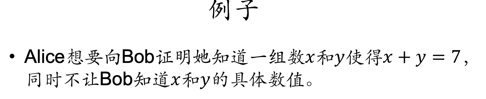

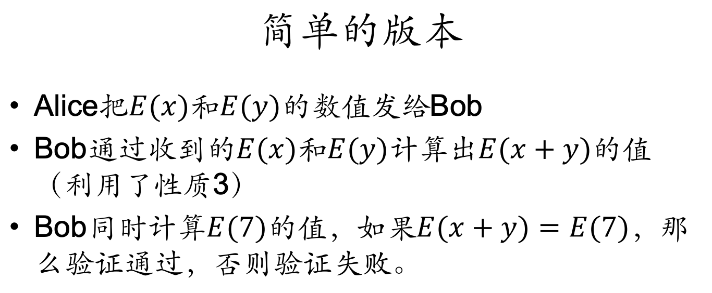

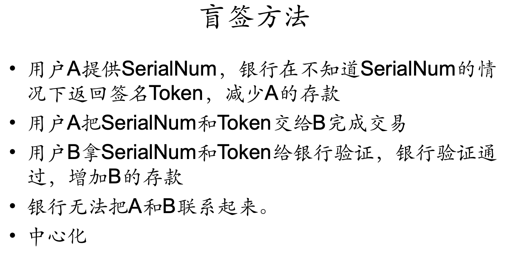

银行不知道是A给钱给了B

为匿名性设计的加密货币：零币和零钞


破坏关联性，只是某个合法存在的币，但是不知道是哪个

应用较少

- 性能较差

- 大部分用户不需要那么强的隐私保护

- 无法解决实体交互泄露隐私的问题

## **1.13 BTC-引起的思考**

- hash pointer只有**本地的地址**，发布到区块链网络上会咋样？
  - 实际上在用的时候，网络上没有指针，只有hash，全节点维护一个数据库保存`(key, value)`，常用的是levelDB。或者说哈希就是指针

- 区块恋
  - 情侣把私钥截成一半给对方，但是截断私钥会降低安全性
    - 如果分手，会永远存在UTXO里，造成集合膨胀，对矿工不友好
  - 应该用多重签名。每个签名都是独立产生的
    - 可以让n个里面出m个即可

- 分布式共识
  - 为什么比特币系统能够绕过分布式共识中的那些不可能结论？
  - BTC实际上也没有取得 **真正的共识**，但是实际和理论是不一样的
  - 分布式系统：在**异步**的时候，不可能区分远程电脑是死机了还是比较慢；但是实际上，我完全可以打电话过去，让那边的人看看是不是死机了，死机了就重启；给服务器连两个线，第二个拨号上网，一般用第一个，如果用第二个也卡了，说明就卡了

- why挖矿？
  - 挖矿收益 > 挖矿支出
  - 如何冷启动？一开始给矿工多的货币
  - 稀缺的不适合作为货币，如果总量**定死**的是不适合货币的；货币是需要一定的膨胀的。
    - 财富不断增加，但是总量定死，那么个人奋斗没有意义，不如长期持有

- 量子计算
  - 量子计算机离使用还有很多距离
  - 如果可以使用，首先冲击传统金融业
  - 比特币没有直接暴露公钥，而是取哈希；只要保管好私钥，公钥丢了也没关系。
    - 如果有人想窃取？需要先通过公钥的哈希，推出公钥，再推出私钥。但是哈希过程是不可逆的，很多信息就丢失了。


# 2 ETH

## **2.1 ETH-概述**

> 根据BTC，改进

- 降低交易时间

- 重新设计了mining puzzle为memory hard（ASIC resistance）
  - 挖矿设备的专业化，都用asics芯片，门槛高了不够去中心化

- 将**权益证明**proof of stake取代**工作量证明**proof of work

- 支持**智能合约smart contract**，增加去中心化的**合约**支持
  - btc是货币去中心化，一个思考，除了currency可以去中心化，我们还能去中心化什么?
  - 跨国的合约，技术手段共识机制保证合同参与方不能违约
  - 好处：合同的签署方是来自全国各地的，没有一个统一的司法标准，但是使用智能合约后，提前把合同写在区块链内，有一个合同有效的保证
  
- 单位：wei , Ether

## **2.2 ETH-账户**

一个账户就是一对公私钥对，我们日常用的地址就是 我们的账户的公钥取哈希然后截取后面的160bit，也就是40位16进制数。


btc采用基于交易的账本，系统中没有显示记录账户中剩余多少钱

BTC的钱需要计算UTXO


ETH使用**account-based ledger**，需要**显式地记录**每个账户有的ETH

优点：对double spending attack有天生的防御性，自己不可修改自己的balance，因为大家都会维护你的这个，你没有办法在状态树里修改所有人的

缺点：但会遇到**replay attack**重放攻击：收款人将某个交易多次广播

解决方法：在交易中加入**nonce**表示某账户的**交易编号**（从0到正无穷），这个nonce在用户状态汇总维护，记录此账户的总交易次数，这样有人重放攻击就可以根据其账户的nonce来判定此交易是否已经交易过了

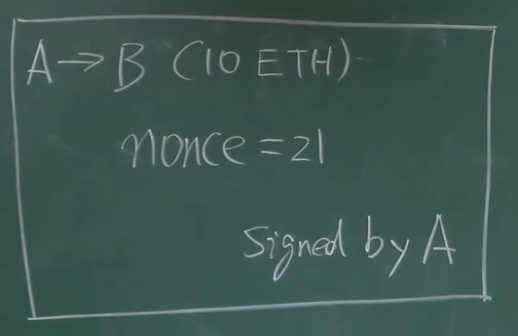

ETH中有两类账户：

> 为什么要这么设计，采用基于账户交易模型？
>
> **btc是基于交易的账户**，使用一次可以换个地址，但是eth有智能合约，所以以太坊需要对身份的绑定，希望账户身份保护稳定，毕竟你不希望一个用户和你签完合约就换号了，你找不到他了，**给合同的执行带来了困难**。

- **externally** owned account（外部账户，类似btc的账户，一对公私钥就是一个账户，也叫普通账户）
  - balance
  - nonce 计数器（其实是counter）
  - 有公钥私钥
  - 所有交易都需要由eoa账户发起
- **smart contract** account 合约账户
  - 不能**主动地发起交易，但是可以调用另外一个合约账户**
  - code
  - storage
  - 创建的时候，会返回一个地址，通过此地址调用，调用的时候code不会变，storage会变

## **2.3 ETH-状态树**

说一说eth的数据结构吧。

ETH需要维护addr到state的映射

ETH**账户地址**160bit，20字节，40个十六进制

state包括balance，nonce，code，storage等


eth是参考btc 而被创造的coin，但是有许多改进，在数据结构上就有许多不一样，比如btc在需要证明余额时，在区块中会验证你所有币的来源加起来，也就是utxo上的你的总余额，因为所有交易都是在区块上以merkle tree形式存储，到顶保存为一个root hash 在block head 存进区块链，保证了无法被篡改，一篡改一个交易，那么他的hash变了，上一级hash连锁改变，最后root hash改变对不上链，就会被验证发现。

那我们基于eth的特点以及参考btc设计一下eth数据结构：

- 大hash表保存所有账户状态信息，区块维护merkle tree ，链接起来保证不可篡改。

merkle proof 证明自己余额交易无法进行。

首先前面说了，eth是有一个状态值的，也就是合约账户。如果单纯的和btc那种， 把40位十六进制地址作为key，value存状态，然后整体这个哈希表组织成merkle tree ，到顶一个root hash在block head存进区块链。那么这样有一个问题，就是每当发布一个新区块的时候，比如你一转账or其他合约签名增删改查操作后会有一个新区块，那我们难道还要把整个大hash表再组织一个merkle tree吗？因为每次状态改变的账户是很少的一部分，尽管哈希表本身的插入更改删除效率不错，但是全部重新组织merkle tree代价太大了。

> 比特币新的区块发布后不需要**重构**merkle tree是因为什么？
>
> 比特币记录的是过程，他的区块记录的内容是immutable的，你需要查找你账户“状态”，比如余额多少，会按照区块链一点点找回去找到所有跟你有关的交易，然后返回结果。所以比特币的新区块只需要构建新区块内包含的交易形成merkle tree。一个区块1mb，大约400个交易，实际会更少几十个也可能，构建是很容易的。
>
> 而这里我们假设的eth是直接大hash表保存最终你的余额以及状态，区块存的不是交易记录过程而是结果，自然每次有新的交易发布新区块就需要全部eth账户重构merkle tree。
>
> > btc的merkle tree记录一个区块时间的交易过程，而eth记录的是整个系统的最终状态，尽管btc出块时间10min很长，在数据量级上还是远远小于eth存整个系统最终状态。所以btc是每个区块组织新的需要组织的交易记录，不需要重构merkle tree。


- 那如果不用哈希表呢，只用一个merkle tree，需要修改了直接改里面的叶子节点。

如果merkle tree叶子节点不排序的话：

这样会导致不同全节点维护的叶子节点顺序不一样，同样的交易集合构建的merkle tree不是唯一的，因为**每个全节点听到交易的顺序**是不一样的，导致一层一层上去的root hash也不一样。

> 比特币的merkle tree也没有排序，那为什么不存在构建不唯一问题？
>
> 首先比特币每个节点收到的交易顺序也是不一样的，但是比特币的区块是**由获得记账权的节点发布**的，由他在本地组装好交易区块，来决定哪些交易在里面，顺序是怎么样的，其他的没有记账权的节点只需要验证，所以即使不排序也不存在构建不唯一问题。
>
> 证明一个交易存在于一个区块中是不需要排序的
>
> 证明一个交易不存在于一个区块中是需要排序的，否则成本是线性的

那eth能不能向btc这样干？每个全节点出块后发布到链上，由别的节点来验证。

不能，最关键的一点还是因为eth区块记录所有账户状态，而比特币的是交易，差很多个数量级。别的节点没法全部去再验证一遍。eth的账户状态大多不变，可以维护在本地，但btc交易必须发布有人在交易不发布怎么交易。


如果我现在使用排序的merkle tree来保证构建merkle tree唯一又有什么问题呢？

因为叶子节点有顺序，那你如果新增一个账户，因为账户是随机的，按照排序落下的叶子节点的位置后面都需要改变顺序，**类似于红黑树里面插入数据需要左旋右旋或者更贴切就是b+树里面的页分裂页合并**。

所以此结构新增删除比较复杂。


- 所以以太坊采用的是MPT结构，Merkle Patricia Tree

> trie 字典树，前缀树

ETH使用类似**trie字典树**的数据结构

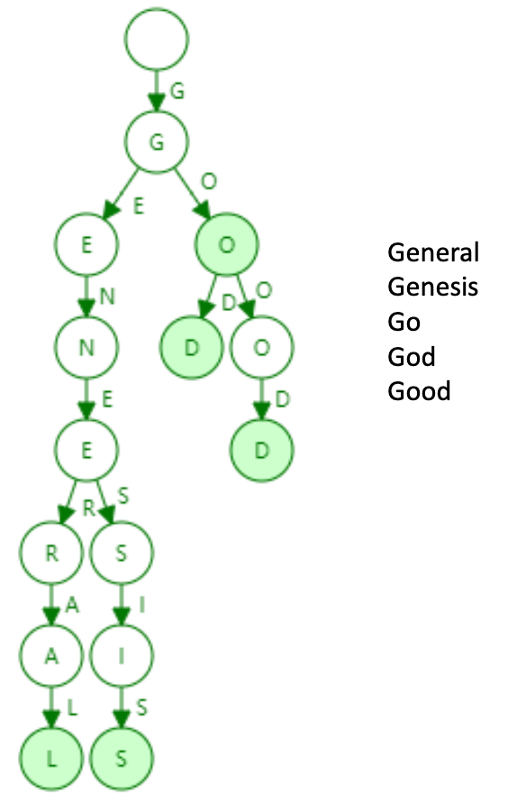

trie的好处

- 分叉数目Branching factor = 17个 因为是0~f + 结束标志符

- trie的效率取决于key的长度，而ETH里的地址长度都是相等的40位16进制数，效率稳定

- 哈希表理论上是会哈希碰撞的，而trie不会碰撞

- 给定一组输入，插入顺序不同，最后结果是是一样的树（不同的节点不管怎么顺序构建这棵树结果都是一样的）

- 更新操作有局部性，只会更改需要改的分支，不影响其他账户

trie的缺点

- 存储浪费，节点数很多共用的一段但是都是单一节点，可以节省为一个节点

trie经过压缩得到Patricia Tree/Patricia Trie**压缩前缀树**，当键值**稀疏**的时候适合使用Patricia Tree，而ETH就是键值非常稀疏（2^{160}）

如果使用trie，效果如下


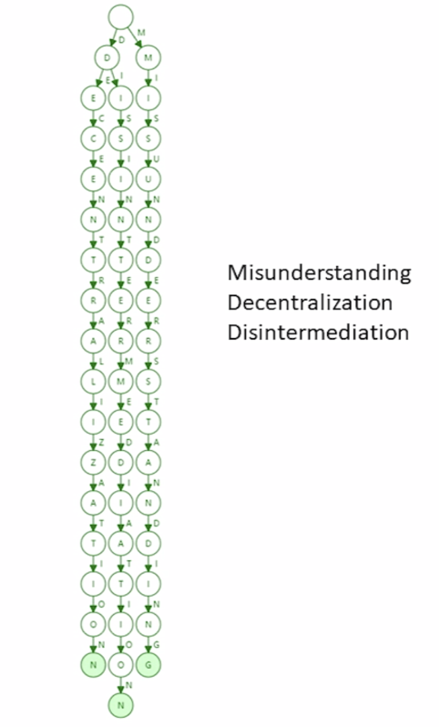


如果使用Patricia Tree，效果如下

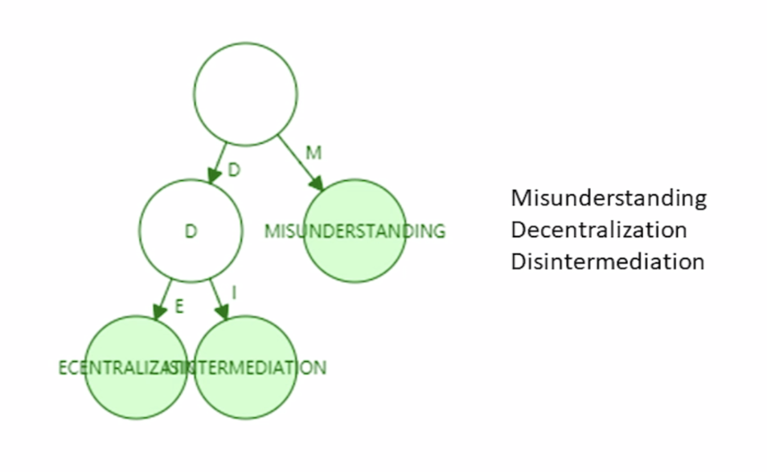

可以看到节省了很多空间。


> 为什么地址长度要设计那么长？
>
> 去中心化系统中，自己本地生成一对公私钥就是账户，为了防止地址碰撞，一定要长。2的160次方，比地球爆炸概率都低。

效果如下

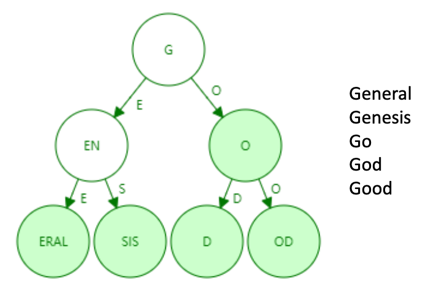

MPT：Merkle Patricia Tree

> Patricia tree的基础上 把指针变成哈希指针
>
> 可以计算出状态树的根哈希值，记在block header里,这是block header里的其中一个根哈希值，一共有三个
>
> > btc系统中block header只有一个哈希值，就是此区块的所有交易组成的merckle tree的根哈希值，eth里也有类似btc的这个跟哈希值，是 交易树的跟哈希值，上面说的是状态树的根哈希值
>
> 
>
> 
>
> 叶子节点和分支节点可以保存value, 扩展节点保存key
>
> 因为MPT树中的key被编码成一种特殊的16进制的表示，再加上最后的value（序列化后），所以分支节点是一个长度为**17**的list，前16个元素对应着key中的16个可能的十六进制字符

- 状态树的根哈希值记载在区块头上 上链后可以防篡改
  - 链头上的hash值不会被改变，下面整棵树的状态值都被保护不会被改

- Merkle Proof以及验证**账户**是否存在

- 保存合约账户里的storage

ETH使用**Modified MPT**

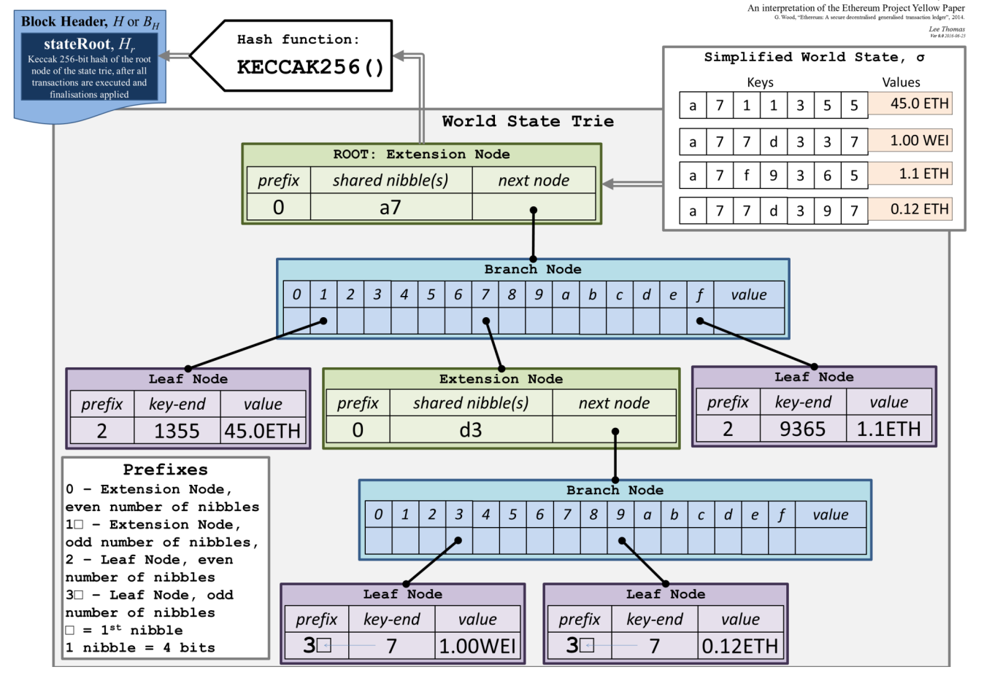

上面这个就是eth的一个状态树

branch node里每个字符下面存的值是 下面那个节点的 哈希值 也就是哈希指针（如果是普通指针那存的就是下面节点的内存地址，这里存的是哈希值就是哈希指针）

根节点取哈希存在block header里


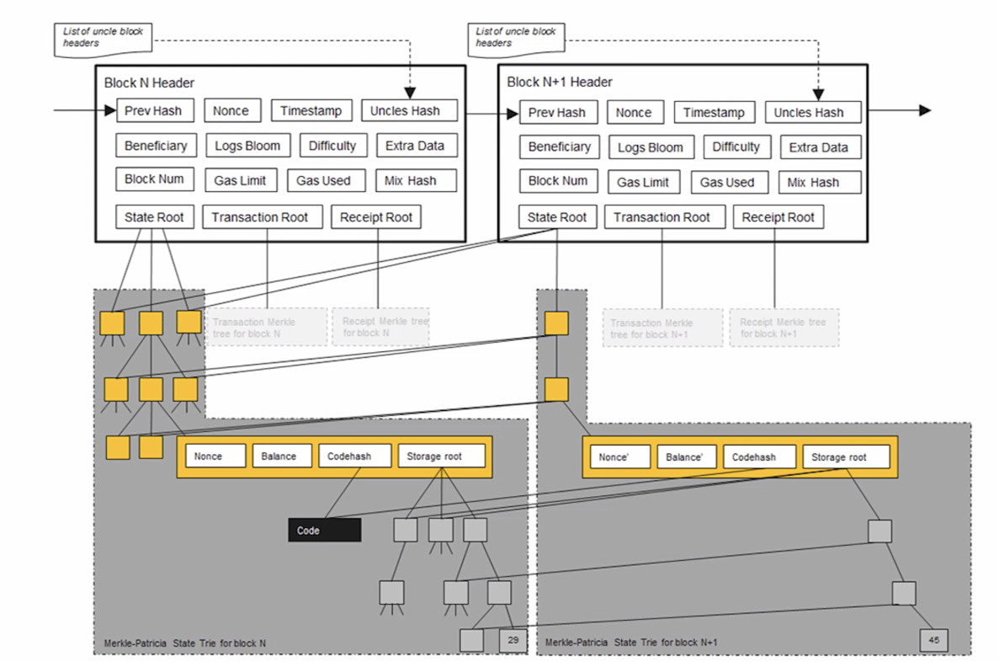

上图就是eth的两个区块，区块下连接一个mpt，此mpt里面也有小的mpt比如图中的code hash，storage hash

每一个合约账户都是一个小mpt，所有账户组成了一个大的mpt存在区块里。

对于状态树，每个区块都要**产生一个新的MPT**，但是这个MPT和之前的MPT大部分节点是相同的，**只需要增加新的分支即可**。

不在原地改的原因：**为了保留历史信息**，临时性分叉很常见，未胜出的节点需要roll back。

> btc的回滚很简单，交易回滚，本身当初交易的脚本就是很简单的扣钱加钱操作，但是eth因为有智能合约的实现，使得通过智能合约执行后反推之前的状态是不可能的。
>
> eth的智能合约是图灵完备的，理论可以实现很复杂的功能，我们没有办法推断智能合约之前的状态，所以为了回滚，我们需要保留历史信息。


eth中数据结构代码

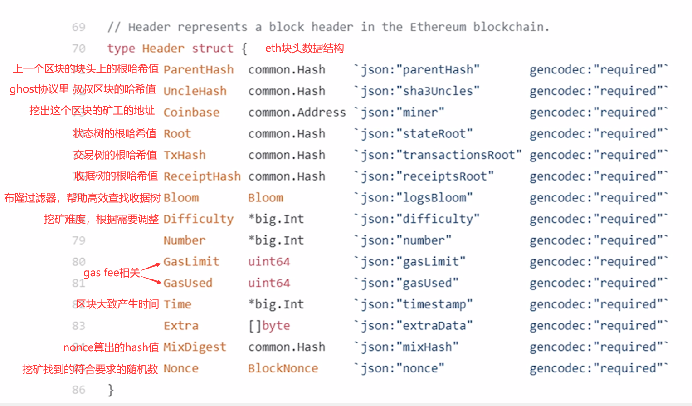

> uncle可能比parent大很多辈，早很多个区块


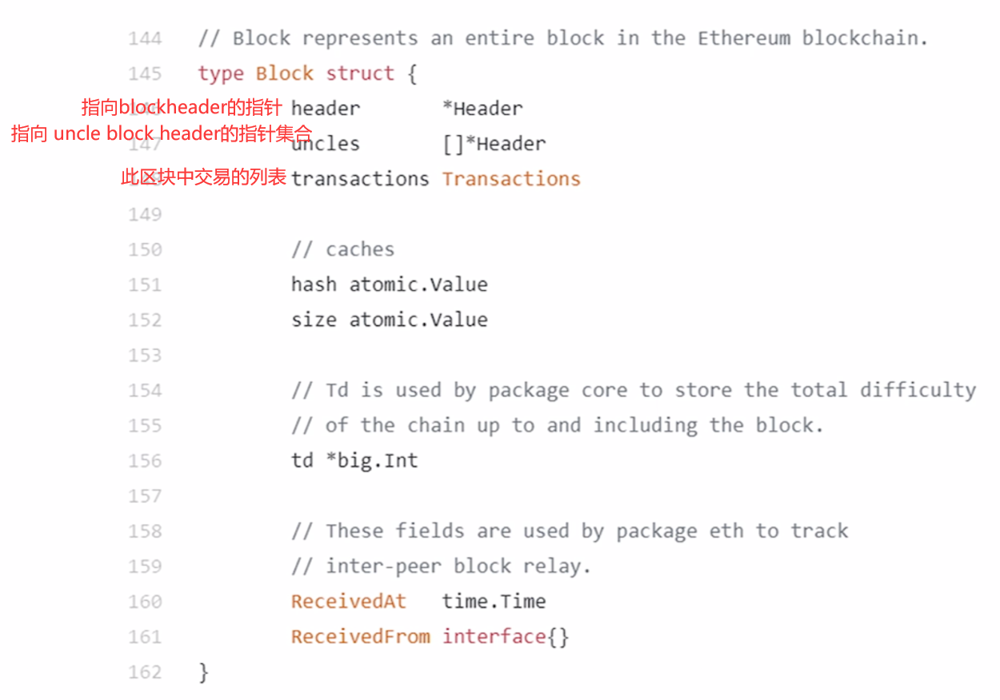

- Header  指向block header的指针
- Uncles 指向叔叔区块的指针（数组）
- transactions 交易的列表


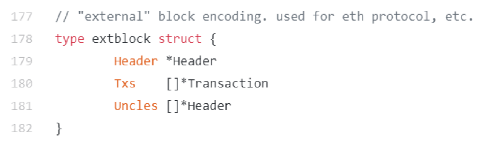

发布时真实的区块信息


上面说的是key的存储方式，那么value呢？

状态树中value序列化之后存储，序列化方法：**Recursive Length Prefix**，**RLP**


通过使用字节数组进行序列化Nested array of bytes

## **2.4 ETH-交易树和收据树**

**每一个交易产生一个收据**，交易树和收据树一一对应，收据树为了方便查询交易

交易树和收据树都使用**MPT**，实际上只是**便于项目管理**都采用MPT，也可以只用Merkle Tree，因为这两种树都是对于某个区块建的，不过也便于查找，用MPT的key是在**当前区块中交易序号**

交易树和收据树只把当前的交易处理成树，而状态树，是所有账户的状态包含

状态树，每个区块都要**产生一个新的MPT**，但是这个MPT和之前的MPT大部分节点是相同的，**只需要增加新的分支即可；**而交易树和收据树每个区块的MPT都是不太一样的，是独立的

交易树和收据树有什么用？

- Merkle proof，证明某个交易在区块中

- 查询操作
  - 所有和某个智能合约有关的区块：一个一个查复杂度较高，所以引入bloom filter
  - 引入Bloom Filter布隆**过滤器**来提高查询速度，但可能出现false positive**假阳性**，一般的Bloom Fiter不支持删除
    - 快速查找某个元素是否在某个集合里
    - 摘要，每个元素去做一个映射到摘要里
    - 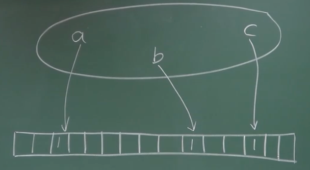

> 交易执行完之后就有一个收据，收据里面有bloom filter
>
> 发布的区块里块头里也有一个bloom filter，是这个区块里所有交易的bloom filter的并集
>
> 
>
> 先查块头的布隆过滤器里有没有，有的话再看具体的交易树有没有
>
> - 好处是快速过滤大量无关区块

ETH看做是**交易驱动的状态机（账户的状态）**（BTC也可以将UTXO看做是状态），状态转移需要是确定性的

一些问题：

- 以下说法是否可行：
  - 可不可以在每个区块中维护一个状态树，只保存当前区块用到的交易账户状态？
    - 不方便去找具体某个用户的账户
    - 查找某个账户余额比较困难，如果你长时间没用这个账户，要往前追溯很多个区块；如果转账账户是一个不存在的区块就需要一直追溯到Genesis创世区块

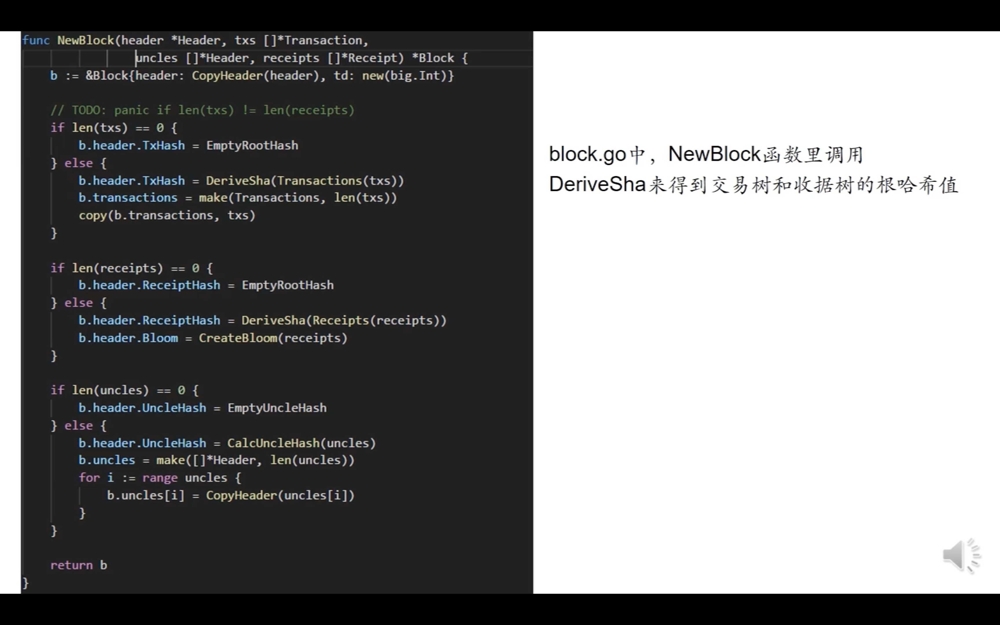

1. 创建交易树，计算根哈希值

1. 创建交易列表

1. 创建收据树，计算根哈希值

1. 创建bloom filter

1. 计算叔父区块的哈希值，构建叔父数组

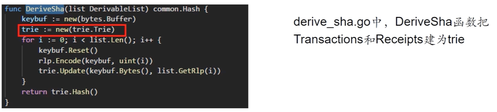

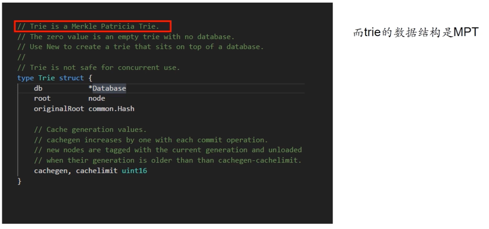

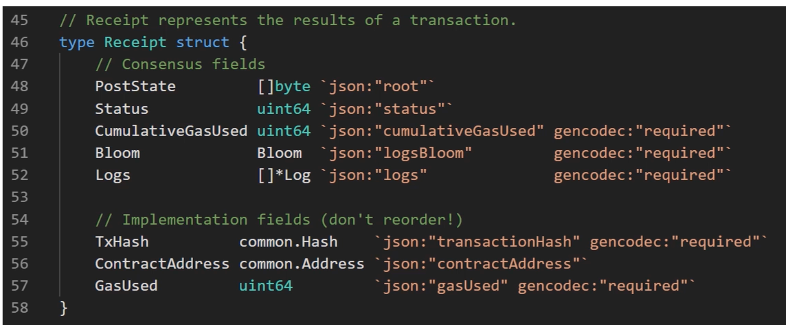

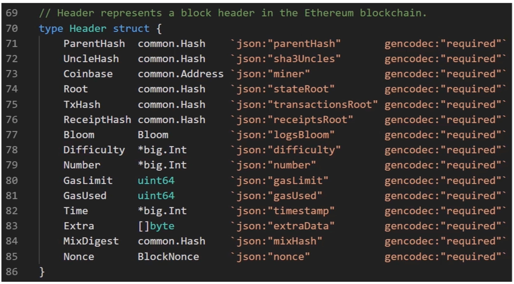

bloom就是全部的并集

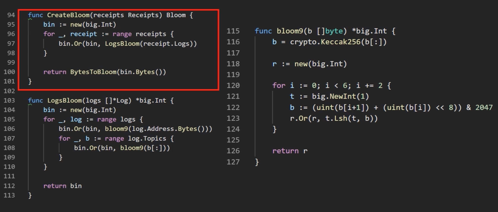

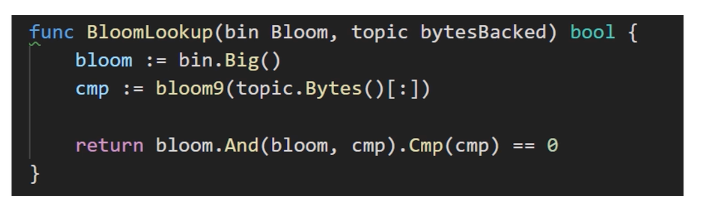


## **2.5 ETH-Ghost协议**

> 出块时间降到了10几秒
>
> 广播收到消息的时间也差不多10秒
>
> 所以会导致分叉很多
>
> - 先挖出来再听到消息
>
> - 很多矿工都白挖了

如果分叉很多，**大型矿池会有centralization bias，大型矿池最容易成为最长合法链**

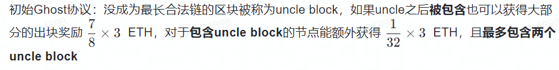

- 鼓励合并成一条链

上述协议的问题：

- 超过两个uncle
  - 2个其实也是合理的，太大ETH就通货膨胀了

- 在最长合法链上拓展时**没有看到**有uncle

- 自私的记账人**故意不包含**uncle

修改Ghost：最长合法链上所有的区块都**认之前的orphan block**为uncle

为防止**先产生很多uncle**，之后一直**包含前面的uncle**，另加规定：当代uncle得到7/8，隔代uncle得到6/8，直到2/8，即uncle block和当前区块**有7代以内**的共同祖先，合法的uncle只有6个辈分，此为**uncle reward**；而包含uncle的block永远是1/32

> 检测当前区块的父亲是否和该块（准叔叔）有共同祖先

- 有利于出现分叉立刻合并

- 以免隔太多代对存储记录造成压力

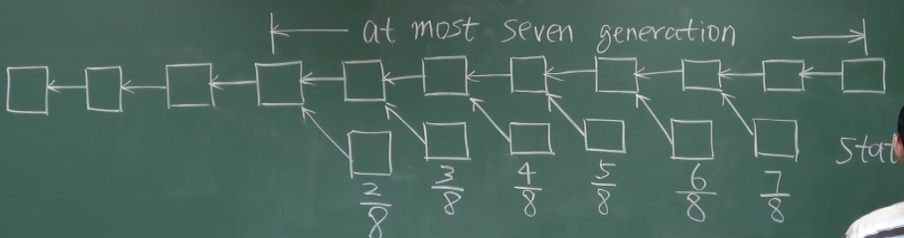

ETH的奖励分为block reward（静态奖励）和gas fee（动态奖励，比较小），但是**uncle block是得不到后者**的

包含uncle block的时候**不会执行uncle block的交易**，只会检查uncle block的合法性（是否符合挖矿难度即是否得到了记账权）


如果分叉链之后还跟着一串，不会对后面跟着的区块提供奖励，只有**第一个uncle可以得到奖励**，如果给后面的uncles提供的话，**forking attack的成本就很低**，因为**不成功的forking attack还能得到奖励**。

这样就可以一定程度上促使大家不去forking attack分叉，因为后面的分叉区块没有uncle 奖励。

## **2.6 ETH-挖矿算法**

> 天然的bug bounty
>
> 找到bug，可以有很多奖励

理想的是one cpu，one vote

目标是**ASIC resistance**，所以设计了**memory hard mining puzzle**

ASIC算力强，内存访问性能没有那么强

LiteCoin莱特币使用的mining puzzle为**scrpyt（对内存要求很高的哈希函数）**


前后依赖，为了高效挖掘，需要保存数组

但是我们希望difficlt to solve，but easy to verify

但是这样verify对于轻节点，也需要记录，verify需要的内存区域和solve的区域**大小相同**

所以为了能在各种小型机器上挖矿，故设置内存大小**仅**为128K，由此导致没有ASIC resistance

ltc出块速度是btc四倍，两分半，其他和btc差不多


ETH有两个数据集16M cache和1G dataset DAG，这两个数据集随时间增长而增大。

轻节点只需要保存16M，全节点是1G

挖矿算法ethash：

有一个数组，对seed取hash放在第一个，然后对第一个取hash放在第二个，由此填满整个cache数组。

然后通过cache中的第`i % cache_size`个元素生成初始mix，然后循环**256**次，每次用`get_int_from_item`来得到下一个要访问的cache元素的下标，用这个cache元素和mix得到新的mix，最后对mix取hash放在dataset的第i个位置

```Go
# 伪代码
# 每隔30000个块会重新生成seed（对原来的seed取hash）
# cache初始大小为16M,每隔30000个区块重新生成时增大初始大小的1/128即128K
 def mkcache(cache_size, seed):
     o = [hash(seed)]
     for i in range(1, cache_size):
         o.append(hash(o[-1]))
     return o
 
 # 求dataset第i个元素
 def calc_dataset_item(cache, i):
     cache_size = cache.size
     mix = hash(cache[i % cache_size] ^ i)
     for j in range(256):
         cache_index = get_int_from_item(mix)# 用哈希值算出index
         mix = make_item(mix, cache[cache_index % cache_size])# 用index再算出哈希值
     return hash(mix)
 
 # 求整个dataset
 def calc_dataset(full_size, cache):
     return [calc_dataset_item(cache, i) for i in range(full_size)]
 
 # 矿工挖矿
 # dataset初始大小为1G,每隔30000个区块重新生成时增大初始大小的1/128即8M
 # 这两个连续的值并无关系
 def hashimoto_full(header, nonce, full_size, dataset):
     mix = hash(header, nonce)
     for i in range(64):
         dataset_index = get_int_from_item(mix) % full_size
         mix = make_item(mix, dataset[dataset_index])
         mix = make_item(mix, dataset[dataset_index + 1])
     return hash(mix)
 
 # 验证，nonce是块头选好的nonce
 # 因为轻节点没有大数据集，所以要在cache独立生成出来
 def hashimoto_light(header, nonce, full_size, cache):
     mix = hash(header, nonce)
     for i in range(64):
         dataset_index = get_int_from_item(mix) % full_size
         mix = make_item(mix, calc_dataset_item(cache, dataset_index))
         mix = make_item(mix, calc_dataset_item(cache, dataset_index + 1))
     return hash(mix)
 
 # mine function
 def mine(full_size, dataset, header, target):
     nonce = random.randint(0, 2**64)
     while hashimoto_full(header, nonce, full_size, dataset) > target:
         nonce = (nonce + 1) % 2**64
     return nonce
```

 

目前以太坊挖矿主要是**GPU挖矿**

目前仍然是PoW（Proof of Work），一直想转向PoS（Proof of Stake权益证明，按照权益证明来投票），这是**不挖矿**的

ETH使用pre-mining，预留了一些ETH（实际上是绝大部分，3/4）给**创始人**

pre-sale相当于众筹，把pre-mining的一些币卖掉，用户买一些初始币，作为后续开发的资金

Hash rate表示全网进行hash的次数/s，表示算力

## **2.7 ETH-挖矿难度的调整**

BTC是每隔2016个区块调整一次。ETH是每个区块都有可能调整难度，且调整算法比较复杂且有多个版本

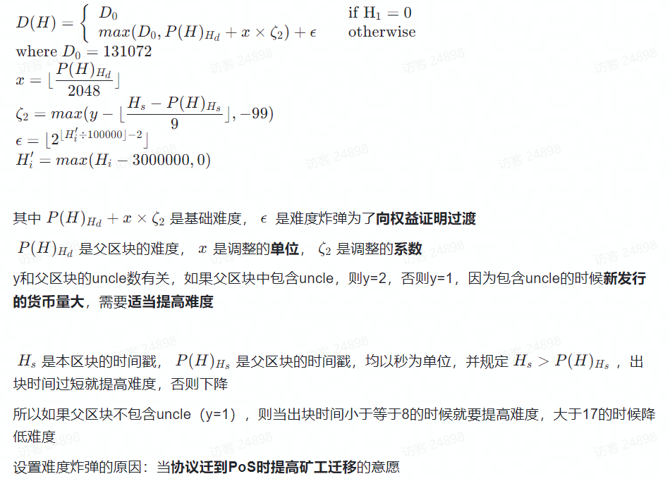

以太坊发展的四个阶段

- Frontier 

- Homestead 

- Metropolis 
  - 又分为Byzantium和Constantinople两个子阶段 
  - 难度炸弹的回调发生在Byzantium这个子阶段， 在EIP（Ethereum Improvement Proposal）中决 定 
  - 同时把block reward从5个ETH降为3个ETH
    - 维护总工作量稳定
    - 不调对之前的矿工不公平 

- Serenity 

### 2.7.1 代码实现

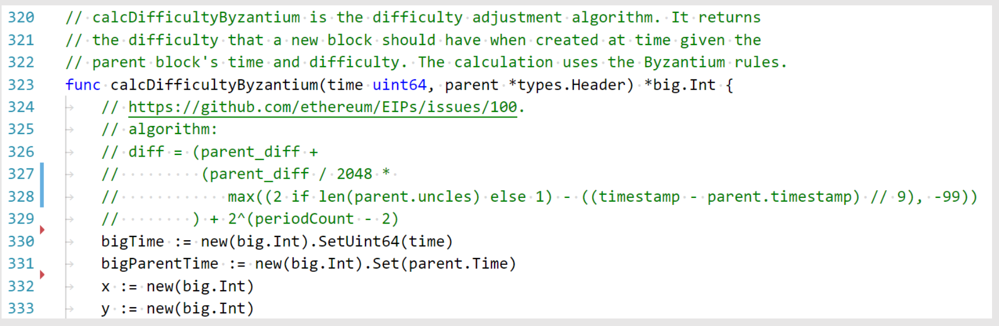

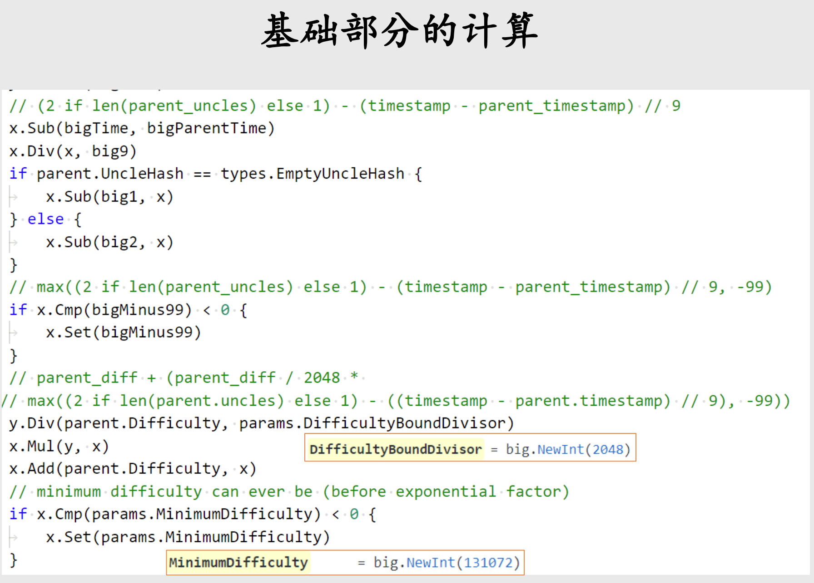

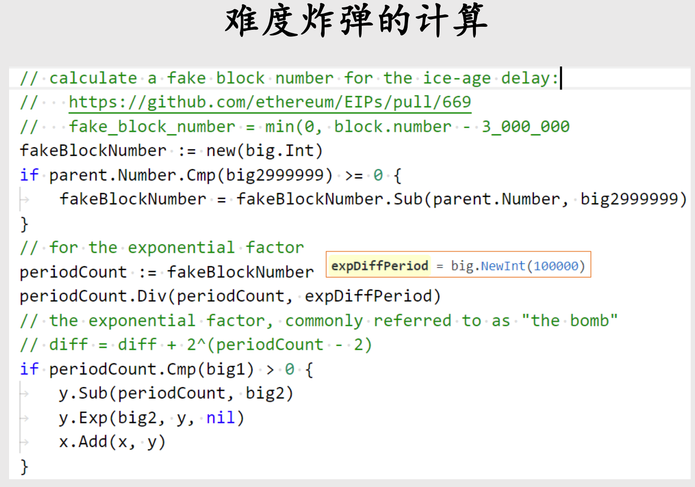

判断父亲节点，用2999999

## **2.8 ETH-权益证明**

> ETH比BTC能耗少，因为出块时间少
>
> [POS](https://blog.csdn.net/qq_38491875/article/details/109045776)

实际上挖矿的收益是靠钱来比的，我们能不能直接用钱来比，按持有货币来证明投票权——权益证明

virtual mining 币的数量就是**投票权**

优点：

- 环保

- PoW没有实现闭环，小币种很容易受到外界大资本的攻击**AltCoin Infanticide**；而PoS中，如果外界资源大量买入该币种，就会**导致升值**，反而使得其不易被攻击

有的币采用PoW和PoS的**混合**，即**挖矿难度和你持有的币的数量相关**，但是这样会有马太效应，所以会有**Proof of Deposit**，你投入一些币来降低挖矿难度，然后这些投入的币在一定时间内不能再用

挑战：

- 出现两边下注情况**nothing at stake**，即多分叉时，你在不同的分叉中投入币来决定哪个分叉是最长合法链，这些**钱是不会被锁定的**，就可以两边下注。犯罪成本降低了

ETH准备使用的权益证明方法叫**Casper the Friendly Finality Gadget (FFG)**

引入Validator验证者，**投入一定ETH**作为保证金被锁定，职责是**推动达成哪条是最长合法链的共识**。每挖除100个区块就作为一个epoch，而epoch成为一个finality需要投票two-phase commit，第一轮投票是prepare message，第二轮投票是commit message，每一轮投票都需要有2/3的通过。

实际实现时：不区分两个message，同时降低epoch为50个区块，要**连续两个epoch**都得到2/3的同意才通过。验证者验证通过也可以得到奖励，有不良行为（不投票）就**扣除部分保证金**，**两边下注全部销毁**，验证者有任期和等待期，当**等待期**无人举报之后可以得到**保证金和奖励**

缺点：

- 不是很成熟

- PoW对环境的影响是有限的
  - 有效化解过剩产能

## **2.9 ETH-智能合约**

智能合约是运行在区块链上的一段代码，代码的逻辑定义了合约的内容

- 智能合约的帐户保存了合约当前的运行状态 
  - balance：当前余额 
  - nonce：交易次数 
  - code：合约代码 
  - storage：存储，数据结构是一棵MPT

- Solidity是智能合约最常用的语言

### **2.9.1 solidity样例**

> 面向对象
>
> 强类型

#### **2.9.1.1 V1**

```Solidity
// 声明使用的solidity版本
 pragma solidity ^0.4.21
 
 contract SimpleAuction {
   // 状态变量
   address public beneficiary; // 拍卖受益人
   uint public auctionEnd; // 拍卖结束时间
   address public highestBidder; // 当前最高出价人
   mapping(address => uint) bids; // 所有竞拍者的出价，哈希表，但是无法遍历
   address[] bidders; // 所有竞拍者
   bool ended; // 是否结束竞拍
   
   // log记录
   // 需要记录的事件
   event HighestBidIncreased(address bidder, uint amount);
   event pay2Beneficiary(address winner, uint amount);
   
   // 构造函数，仅在合约创建时调用一次
   // 以受益者地址`_beneficiary`的名义，
   // 创建一个简单的拍卖，拍卖时间为`_biddingTime`秒
   constructor(uint _biddingTime, address _beneficiary) public {
     beneficiary = _beneficiary;
     auctionEnd = now + _biddingTime;
   }
   
   // 成员函数，可以被一个外部账户或者合约账户调用
   // payable表示能接受外部账户的转账
   // 对拍卖进行出价，随交易一起发送的ether与之前已经发送的ether的和为本次出价
   // 没有系数，系数在函数里 msg.sender
   function bid() public payable {
     // 拍卖尚未结束
     require(now <= auctionEnd);
     // 如果出价不够高，本次出价无效，直接报错返回
     require(bids[msg.sender] + msg.value > bids[highestBidder]);
     // 如果此人之前未出价，则加入到竞拍者列表中
     if (!bids[msg.sender] == uint(0)) {
       bidders.push(msg.sender);
     }
     // 本次出价比当前最高者高，取代之
     highestBidder = msg.sender;
     bids[msg.sender] += msg.value;
     emit HighestBidIncreased(msg.sender, bids[msg.sender]);
   }
   
   // 结束拍卖，把最高的出价发送给受益人
   // 并把未中标的出价者的钱返还
   function auctionEnd() public {
     // 拍卖已截止
     require(now > auctionEnd);
     // 函数未被调用过
     require(!ended);
     
     // 把最高的出价发送给受益人
     beneficiary.transfer(bids[highestBidder]);
     for (uint i = 0; i < bidders.length; i++) {
       address bidder = bidders[i];
       if (bidder == highestBidder) continue;
       bidder.transfer(bids[bidder]);
       // 注意!!!
       // 如果Hacker有个合约账户调用bid而它没有fallback函数，那么当退款的时候transfer发生问题
       // 就会全部回滚，导致所有人都没有收到钱(solidity在执行过程中改的本地的状态，只有最后发布在Block Chain之后所有节点都照着做一遍)
     }
     ended = true;
     emit AuctionEnded(highestBidder, bids[highestBidder]);
   }
 }
数组：push / length
hash表默认为0，不支持遍历，需要另外存储
```

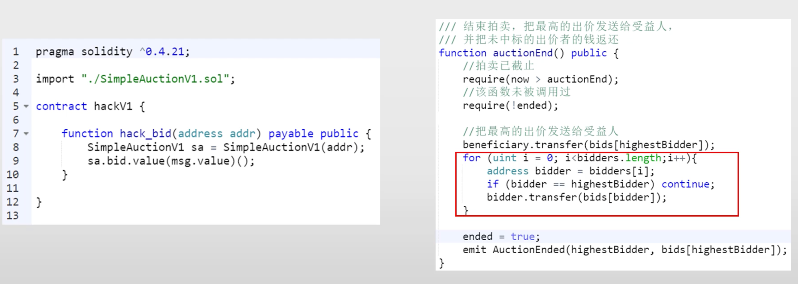

没有fallback函数，退款的时候transfer出问题

修改了本地的数据结构，后面的没有执行，导致全部回滚

其他人也全部一致，全部回滚 

> Code is law
>
> 永远无法更改
>
> 需要测试测试再测试
>
> 也是去中心化的宿命

#### **2.9.1.2 V2**

为了解决上述问题，提出：让投标者自己取回标价，将上述`auctionEnd`函数修改成两个小函数

```Solidity
 // 使用withdraw模式
 // 由投标者自己取回出价，返回是否成功
 function withdraw() public returns (bool) {
   // 拍卖已截止
   require(now > auctionEnd);
   // 竞拍成功者需要把钱给受益人，不可取回出价
   require(msg.sender != highestBidder);
   // 当前地址有钱可取
   require(bids[msg.sender] > 0);
   
   uint amount = bids[msg.sender];
   if (msg.sender.call.value(amount)()) {
     bids[msg.sender] = 0;
     return true;
   }
   return false;
 }
 
 event Pay2Beneficiary(address winner, uint amount);
 // 结束拍卖，把最高的出价发送给受益人
 function pay2Beneficiary() public returns (bool) {
   // 拍卖已截止
   require(now > auctionEnd);
   // 当前地址有钱可取
   require(bids[highestBidder] > 0);
   
   uint amount = bids[highestBidder];
   bids[highestBidder] = 0; // 注意这里先置为0然后再withdraw
   emit Pay2Beneficiary(highestBidder, bids[highestBidder]);
   
   if (!beneficiary.call.value(amount)()) {
     bids[highestBidder] = amount;
     return false;
   }
   return true;
 }
但是还可以发动重入攻击 (Re-entrancy Attack)：
 function() public payable {
   stack += 2;
   if (msg.sender.balance >= msg.value && msg.gas > 6000 && stack < 500) {
     SimpleAuctionV2(msg.sender).withdraw();
   }
 }
```

当contract的`withdraw`执行到`msg.sender.call.value(amount)()`时，就会触发上面的fallback函数，此时又会调用`withdraw`，陷入递归。

如果先转账，再清零，会有重入攻击，不断地递归调用withdraw，而永远到不到下面函数，去清零；小心自己调用自己

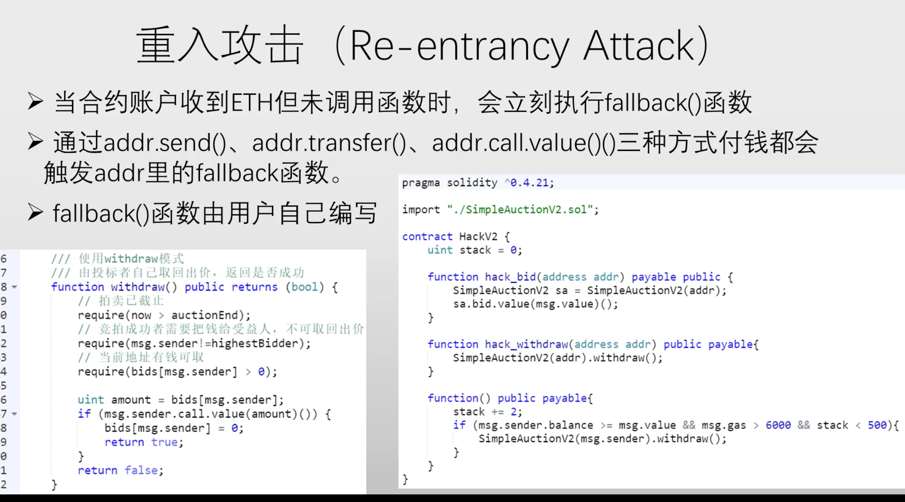

但是上面的写法没有问题，因为已经**先把对应账户余额设置成0了**

最好将call改成send或者transfer，因为gas fee比较少，只能写一个log

### **2.9.2 调用智能合约**

外部账户如何调用智能合约？创建一个交易，接受地址为**智能合约的地址**，data域填写要调用的函数以及参数的编码

合约如何调用另一个合约中的函数？

```Solidity
contract A {
   event LogCallFoo(string str);
   function foo(string str) returns (uint) {
     emit LogCallFoo(str); // 调用该函数，写一个log
     return 123;
   }
 }
 
 contract B {
   uint ua;
   function callAFooDirectly(address addr) public {
     A a = A(addr);// 实例
     ua = a.foo("call foo directly");
   }
 }
 // 上述foo如果出现问题就会导致B的合约内容也全部回滚
 // 合约账户不能发起交易，需要其他账户来调用合约账户
  
 contract C {
   function callAFooByCall(address addr) public returns (bool) {
     bytes4 funcsig = bytes4(keccak256("foo(string)"));
     if (addr.call(funcsig, "call foo by func call"))
       return true;
     else return false;
   }
 }
 // addr.call
 // 如果foo出现错误不会回滚C中其他内容
 
 // delegatecall()和call()的区别
 // 不能调用.value()
 // 区别在于是否切换上下文，不需要切换到被调用的智能合约
 // call()切换到被调用的智能合约上下文中
 // delegatecall()只使用给定地址的代码,其它属性（(存储,余额等)都取自当前合约。delegatecall 的目的是使用存储在另外一个合约中的库代码。

fallback函数
 // fallback()函数
 function() public [payable]{
 ...
 }
 // 匿名函数,没有参数也没有返回值。在两种情况下会被调用:
 // A 调用 B，要在转账合约里的data域里写调用的是B的哪个函数
 // 1.直接向一个合约地址转账而不加任何data
 // 2.被调用的函数不存在
 
 // 默认
 // 如果转账金额不是0，同样需要声明payable，否则会抛出异常。
 // 如果所有函数没有payable的，fallback需要是payable，否则容易抛出异常
```

### **2.9.3 智能合约的创建和运行**

- 智能合约的代码写完后，要编译成bytecode

- 创建合约：外部帐户发起一个转账交易到0x0的地址
  - 转账的金额是0，但是要支付汽油费
  - **合约的代码**放在data域里

- 智能合约运行在**EVM** (Ethereum Virtual Machine)上
  - 通过增加一个虚拟机，增强移植性
  - 256位寻址

- 以太坊是一个**交易驱动的状态机**
  - 调用智能合约的交易发布到区块链上后，**每个矿工都会执行这个交易**，从当前状态确定性地转移到下一个状态

- 挖矿和智能合约的执行先后顺序？
  - 三棵树是全节点在本地维护的，交易只需要先在本地减掉余额（一开始都是本地的，只有发布区块链了，才会是共识）。注意**Block Header**中有三棵树的根hash值，而试nonce的时候需要固定Block Header
  - 所以必须先执行**所有的合约**，得到Block Header，才能得到三棵树的根hash，才能试nonce
  - 如果我在**本次消耗资源执行智能合约**但是**最后没有记账权**，我能得到啥？
    - Gas Fee是没有的，只给最后得到记账权的人
    - uncle reward也是没有必要的，因为无记忆性，比如直接切换到最长合法链上挖
      - 因为你没挖出来块，你接下来继续挖还是切换到最长合法链都是一样的，因为无记忆性，而且你做uncle不如直接当爹，reward更高，所以没必要
    - 实际上没有补偿，而且得自己本地**再验证一遍**，假如我不验证（后果是影响安全性），三棵树的内容没有更新，就得不到正确的根hash值；自己没法再挖矿了

- 如果智能合约**出错也要发布到区块链上**，因为也要有**Gas Fee**

- 智能合约支不支持多核并行处理？不支持，因为状态机必须是**完全确定。**所有全节点要到同一状态，而多线程多个核对内存执行顺序不一样的话，**执行结果**可能是不一样的。
  - 同时也**不能产生真随机数**，结果不一样

### **2.9.4 Gas Fee**

- 智能合约是个**Turing-complete Programming Model**
  - 出现死循环怎么办？因为有**Gas Limit**，所以即使是Halting Problem也没关系

- 执行合约中的指令要收取汽油费，由发起交易的人来支付

```Solidity
type txdata struct {
   AccountNonce uint64  `json : "nonce"   gencodec : "required"`
   Price        *bigInt `json: "gasPrice" gencodec : "required"`
   GasLimit     uint64  `json: "gas"      gencodec : "required"`
   Recipient    *commonAddress `json:"to" rlp: "nil"` // nil means contract creation
   Amount       *bigInt `json: "value"    gencodec : "required"`
   Payload      []byte  `json: "input"    gencodec : "required"`
 }
 
 //payload 是data域，调用什么函数就是写在这里
```

- EVM中不同指令消耗的汽油费是不一样的

- 简单的指令很便宜，复杂的（取哈希）或者需要**存储**状态的指令就很贵，读取公共数据的可以使免费

### **2.9.5 错误处理**

- 原子性

- 首先会按照gas limit扣除，如果GasFee不够的话（到达gas limit）就会**回滚**交易，但Gas也不会**退回**，防止DDos攻击；成功后，剩下的会退回

- 智能合约中不存在自定义的try-catch结构

- 一旦遇到异常，除特殊情况外，本次执行操作全部回滚

- 可以抛出错误的语句:
  - assert(bool condition):如果条件不满足就抛出—用于**内部**错误。 
  - require(bool condition):如果条件不满足就抛掉—用于**输入**或者**外部组件**引起的错误。
  - ```Solidity
    function bid() public payable {
            //对于能接收以太市的函数，关键字payable是必须的。
    
            // 拍卖尚未结束
            require( now <= auctionEnd) ;
    }
    ```

  - revert():终止运行并回滚状态变动。

### **2.9.6 嵌套调用**

- 智能合约的执行具有原子性:执行过程中出现错误，会导致回滚

- 嵌套调用是指一个合约调用另一个合约中的函数

- 嵌套调用是否会触发**连锁式的回滚**?
  - 如果被调用的合约执行过程中发生异常，会不会导致发起调用的这个合约也跟着一起回滚?
  - 有些调用方法会引起连锁式的回滚，有些则不会
  - Call 只会返回false，不会连锁式回滚

- 一个合约直接向一个合约帐户里转账,没有指明调用哪个函数,仍然会**引起嵌套调用**，比如调用fallback函数

### **2.9.7 Block Header与Gas有关的部分**

- Gas Limit
  - BTC可以用**1M**大小（**写死**）来约束资源使用，而ETH使用**Gas Limit**来约束资源使用，所有合约gas消耗的上限，这个Limit可以由矿工**微调**，可以根据上一块的Limit上下调整1/1024

- Gas Used
  - 块里所有gas fee 相加

### **2.9.8 Receipt数据结构**

```Solidity
// Receipt represents the results of a transaction.
type Receipt struct {
        // consensus fields
        Poststate                   []byte `json : "root"`
        Status                           uint64 `json : "status"`
        CumulativeGasUsed uint64 `json: " cumulativeGasUsed" gencodec : "required"`
        Bloom                           Bloom  `json : "logsBloom"         gencodec : "required"`
        Logs                          []*Log `json: "logs"               gencodec : "required"`
        
        // Implementation fields (don't reorder ! )
        TxHash                           common.Hash     `json : "transactionHash" gencodec : "required"`
        ContractAddress   common. Address `json : "contractAddress"`
        Gasused           uint64          `json : "gasused"         gencodec : "required"`
}
```

`Status`表示执行状态，是否成功与否

### **2.9.9 智能合约可以获得的区块信息**

> 智能合约不能通过system call来得到环境信息，因为每个全节点执行环境是不一样的，而智能合约需要完全确定，每个全节点同一状态

- `block.blockhash(uint blockNumber) returns (bytes32)`:给定区块的哈希-仅对最近的256个区块有效而不包括当前区块

- `block.coinbase (address)`:挖出当前区块的矿工地址

- `block.difficulty (uint)`:当前区块难度

- `block.gaslimit (uint)`:当前区块gas限额

- `block.number(uint)`:当前区块号

- `block.timestamp (uint)`:自unix epoch 起始当前区块以秒计的时间戳

### **2.9.10 智能合约可以获得的调用信息**

- `msg.data(bytes)`:完整的calldata
  - 调用什么函数以及参数

- `msg.gas(uint)`:剩余gas

- `msg.sender(address)`:消息发送者（当前调用)

- `msg.sig(bytes4)`: calldata的前4字节（也就是函数标识符)

- `msg.value(uint)`:随消息发送的wei的数量

- `now(uint)`:目前区块时间戳( block.timestamp )

- `tx.gasprice(uint)`:交易的gas价格

- `tx.origin(address)`:交易发起者（完全的调用链)

注意：消息发送者和交易发起者不一定相同，前者是当前合约调用方（局部），而后者是整个调用链最初的发起者

### **2.9.11 地址类型**

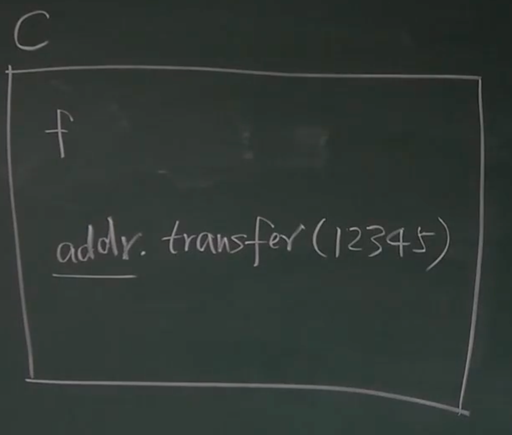

**成员变量：**

`<address>.balance(uint256)`:以Wei为单位的地址类型的余额。uint256是成员变量的类型，不是参数

**成员函数：**

注意下面的address都是**转入地址/被调用地址**

`<address>.transfer(uint256 amount)`:当前合约账户向**地址类型（转入地址）**发送数量为amount的Wei，失败时抛出异常，发送2300gas的矿工费，不可调节。**会产生连锁回滚**。gas fee比较少，基本只能写个log。上面那个例子是从C把钱转移到addr

`<address>.send(uint256 amount) returns (bool)`:向地址类型发送数量为amount的 wei，失败时返回false，发送2300gas 的矿工费用，不可调节。**不会产生连锁回滚**，gas fee比较少，基本只能写个log

`<address>.call(...) returns (boo1)`:发出底层`CALL`，失败时返回false，发送所有可用gas，不可调节。调用address这个合约

- `<address>.call.value(uint256 amount) returns (bool)()`，**不会产生连锁回滚**，**发送所有可用gas，可用做更多的事情**

`<address>.callcode(...) returns (boo1)`:发出底层`CALLCODE`，失败时返回false，发送所有可用gas，不可调节。

`<address>.delegatecall(...) returns (boo1)`:发出底层`DELEGATECALL`，失败时返回false，发送所有可用gas，不可调节。

所有智能合约均可显式地转换成地址类型

- transfer会连锁回滚
  - gas少
  - 应用场景：普通的交易，会级联回滚，收回用不完的gas fee，保持原子性，但是send如果报错了，会修改，没有办法保证原子性。

- send不会连锁回滚
  - gas少
  - 应用场景：多人交易，存在恶意的交易，不会抛异常，也就只会牺牲一个账号交易失败，其他都可以正常；如果是transfer，会级联回滚，导致大家交易都失败

- call本意是调用函数，但是也可发送转账
  - 所有gas

## **2.10 ETH-TheDAO**

DAO：Decentralized Autonomous Organization

- 建立在技术基础上

TheDAO，2016年5月出现的一个投资自治组织，将ETH换取TheDAO的代币，作为投资的投票权，也是最后划分受益的比例

短时间获取了大量的ETH

收取收益是使用**splitDAO**方法，拆分TheDAO可以成立**childDAO（类似子基金）**，成立之后有**28天锁定期**

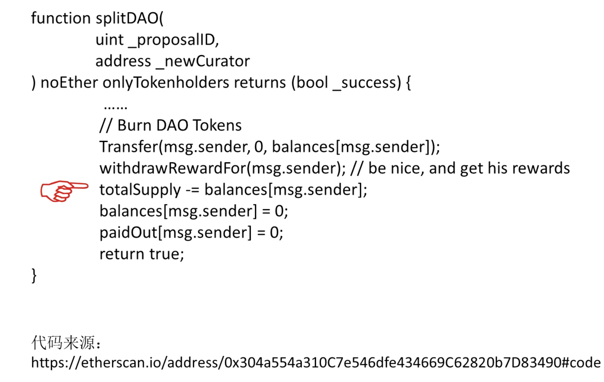

先交易，后清零。存在漏洞。

Hacker利用重录攻击。ETH团队决定回滚，原则是**只回滚与该交易有关的内容**

第一步：修改协议，和TheDAO有关的账户不能进行交易——**软分叉**，但是出现了BUG，与这些账户进行交易应该是非法交易，但是gas fee还是要收的，以防DDos攻击，但是修改的时候出现BUG，这类交易没有收gas fee，最后矿工回滚版本，这个方案就失败了

第二步：与TheDAO相关的账户**强行转到新账户**上去，而不需要签名等——**硬分叉**，新的feature是不符合老的矿工的认知的。

ETH分裂成ETH和ETC (Ethereum Classic)，给这两条链加上chainID

为什么不在黑客的账户上处理？而是对The DAO操作

因为The DAO所有的账户都有bug，任何人都可以模仿黑客去攻击，对黑客处理治标不治本

## **2.11 ETH-反思**

- 智能合约是否真的智能？
  - 实际上是自动合约，类似于ATM机；其实不智能

- 不可篡改性是双刃剑
  - 有bug不能改

- 没有什么是不可篡改的
  - 软件升级强行修改

- solidity存在问题，反自然的
  - 设计上有问题
  - 可以尝试采用函数式语言。
  - Formal Verification 如何形式化证明 代码的功能
  - 模板
  - 专门的**智能合约机构**
  - 图灵完备是否好？有些人认为语言表达能力要**适中**，但**很难预料到之后的攻击和漏洞**等。

- **合约代码开源**提高**共性力**和**安全**，但是还是**存在漏洞**，称为many eyeball fallacy，要小心仔细

- 硬分叉的过程是否只是核心团队的决策？并不是，而是广大矿工用脚投票的结果，分叉是**民主**的体现，对规则的修改是通过去中心化的方式完成的。分叉恰恰是民主的体现。

- 去中心化不等于分布式系统，前者一定是分布的，但后者不一定是去中心化的。后者是用多个机器来提高运行效率，前者是为了**容错**（**状态机**模式，机器数目越多越慢，需要同步状态，传统分布式系统状态机模式，机器特别少）（只有那些需要在**不信任的大群体**之间**建立共识**才需要智能合约）

## **2.12 ETH-美链**

ICO：Inital Coin Offering

IPO：Initial Public Offering

Beauty Chain是在部署在以太坊上的智能合约，有自己的代币BEC

- 没有自己的区块链，代币的发行、转账都是通过调用智能合约中的函数来完成的 

- 可以自己定义发行规则，每个账户有多少代币也是保存在智能合约 的状态变量里 

- ERC 20（Ethereum Request for Comments）是以太坊发布代币的标准，规范了所有发行代币的合约应该实现的功能和遵循的接口 

- 美链中有一个叫batchTransfer的函数，它的功能是向多个接收者发送代币，然后把这些代币从调用者的帐户上扣除

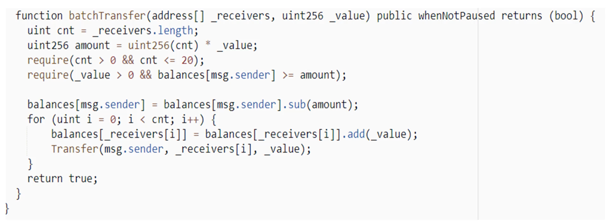

`uint256 amount = uint256(cnt) * _value`出现问题（`cnt`表示接受转账的账户个数），如果`_value`很大，就会导致**溢出**使得`amount`变得很小，故当前账户只扣一点点钱，而其他账户会受到一大笔钱

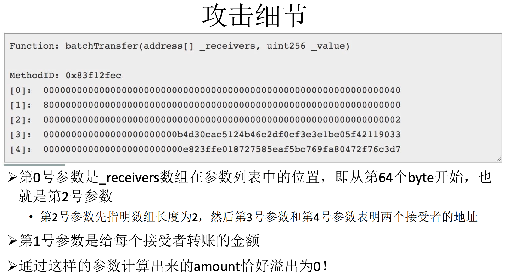

第0号参数是地址，第1号参数是value的值，第2号参数是数组的具体内容，是2

solidity有专门的数学库`SafeMath`库，会自动检测是否溢出

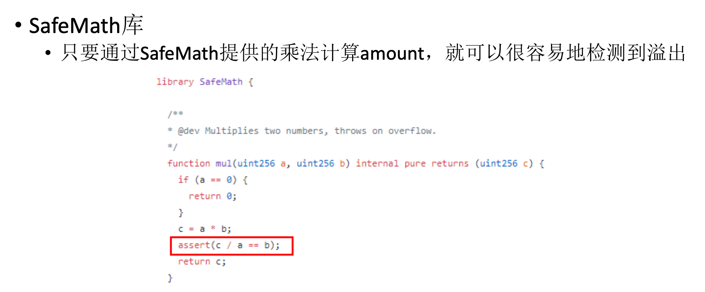

# **3 课程总结**

中心化和去中心化不是泾渭分明的，一个系统可以有中心化成分也可以有去中心化成分。

比特币只是一种支付方式，中心化的商品当然也可以用去中心化的方式支付。

加密货币应该用在传统货币不能很好解决的场景，例如跨境转账

Software is eating the world

去中心化一定是好事情吗？具体问题具体分析